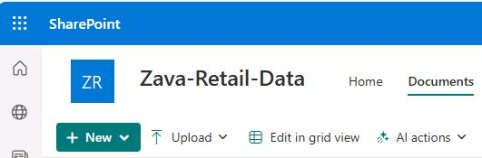
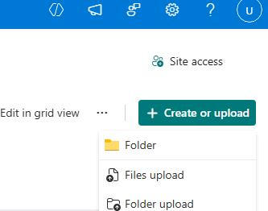
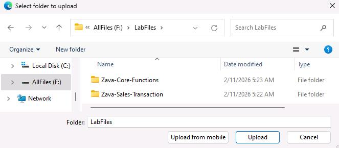
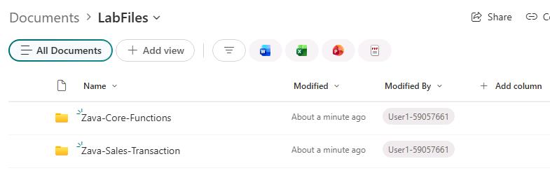

## Task 01: Create a SharePoint site and document library
<!---Reviewed, mjc 1/25/2026--->
<!---Estimated duration: 6 minutes --->

In this exercise you'll create a SharePoint site and configure a SharePoint document library. Later in the lab you'll use the document library as a knowledge source for your Copilot Studio agent, providing a foundation for the generative answers actions in your custom topics.

### Key steps

---

#### 01: Create a SharePoint site

1. Open a new browser tab, and go to [lodsprodmslearnmca.sharepoint.com/_layouts/15/sharepoint.aspx](lodsprodmslearnmca.sharepoint.com/_layouts/15/sharepoint.aspx).

1. If prompted, sign in by using the following credentials:

    | Item | Value |
    | ---- | ----- |
    | Username | `@lab.CloudPortalCredential(User1).Username` |
    | Temporary Access Pass (TAP) token | `@lab.CloudPortalCredential(User1).AccessToken` |

1. On the command bar, select **Create site**.

    

1. In the **Create a site: Select the site type** dialog, select **Communication site**.

    

1. In the Select a Template dialog, select **Standard communication**.

    

1. In the **Preview and use...** dialog, select **Use template**.

1. In the **Give your site a name** dialog, enter the following details and then select **Next**.

    | Item | Value |
    | ---- | ----- |
    | Site name | `Zava-Retail-Data` |
    | Site description | `The central hub for company resources, documents, and operational information accessible to all employees.` |
    | Site address suffix | `Zava-Retail-Data@lab.LabInstance.Id` |

	{: .note }
    > The names of all resources that you create end with an eight-digit number. This number is the unique identifier for your lab instance.
	>
	> The lab instance number in the screenshots will not match your lab instance number. The numbers from the screenshots represent the lab instance number in use when youcaptured screenshots.

1. Select **Create site**.

    

	{: .note }
    > It may take a couple of minutes for the site to be created.

---

#### 02: Upload documents to the document library

1. On the command bar for the site, select **Documents**.

    

1. On the **Documents** page, on the command bar, select **+ Create or upload** and then select **Folder upload**.

    

1. Go to `F:\LabFiles`, and then select **Upload**.

    

1. Wait until the confirmation dialog is displayed.

	

1. In the document library, select **LabFiles**. The two folders should now be visible.

	

1. Open the **Zava-Core-Functions** folder. This will allow you to view the files you previously uploaded.

	| Folder | Contents |
	|---------|---------|
	| cashiers   | Point-of-sale operations data   |
	| customers_loyalty   | Rewards program membership data   |
	| marketing   | Campaigns and promotional assets   |
	| rd   |Research and development data   |
	| returnitems  | Product return workflows   |
	| taxt_rule   | Tax configuration information and rule sets |
	| zavavision   | Analytics and visualization tools   |

1. Navigate back to the **LabFiles** directory and open the **Zava-Sales-Transaction** folder to examine the files you uploaded.

	| Folder | Contents |
	|---------|---------|
	| Zava-Sales-Transactions   | Central repository for all sales, operations, and analytics data |	
