## Task 02: Build a topic that greets the customer, extracts refund details, and validates transactions

### Introduction

To demonstrate credible business value, Zava’s COE must show agents can execute structured workflows, not just answer questions. Refund and cancellation scenarios are high-frequency, policy-sensitive interactions where a modular topic design reduces errors, improves consistency, and makes future changes safer.

### Description

In this task, you'll build the **refund-initiator** topic as a reusable workflow module. The topic retrieves order details from the sales transaction knowledge source, extracts key entities from the user request in a structured format, and applies eligibility logic for the 30-day return policy and Platinum flexibility. The topic also prepares a controlled handoff by storing only the required fields in a shared context variable for downstream topics.

### Success criteria
- A topic named refund-initiator exists and is saved with a clear description and trigger behavior aligned to refund-related intents.

- The topic includes a generative answers node that:
   - Uses only the Zava Order Lookup (Sales Transactions) knowledge source.
   - Saves the model output into a variable for downstream processing.
   - Uses high content moderation settings as specified.

- An AI prompt is implemented to extract entities as structured JSON without extra text, and output is stored in jsEntityExtraction.


### Key steps

#### 01: Add a topic to handle customer-facing order-related tasks

1. On the command bar for the agent, select **Topics**.

	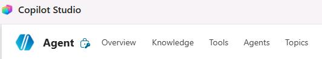
	
1. On the **Topics** page, select **Add a topic** and then select **From blank**.

	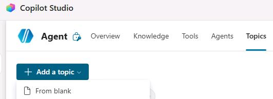

1. Change the name from **Untitled** to `refund-initiator` and then press the **Enter** key to save the change.

	

	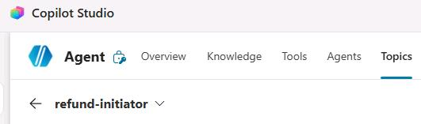

1. In the **Describe what the topic does** field, enter the following text:

	```
	This topic must activate without exception for any customer request involving refunds, returns, replacements, defective or damaged items, or order cancellations.
	```

1. On the command bar for the agent, select **Save**.

1. If the **Test** pane is not open, on the command bar for the agent, select **Test**.

	

1. In the **Test** pane, select **Start new test session** (the **+** sign).

	

1. Submit the following prompt: 

    ```
    How can I request a refund for order TXN‑2008, which I no longer need?
    ``` 

1. Review the response.

	{: .note }
    > Your output may vary slightly from the screenshot provided below.

	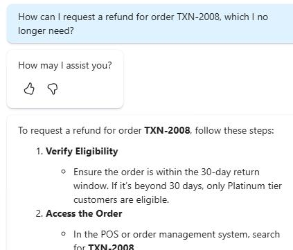

---

#### 02: Optimize the agent instructions for handling customer requests

1. On the command bar for the agent, select **Overview**.

	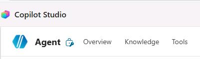

1. On the **Instructions** tile, select **Edit**.

	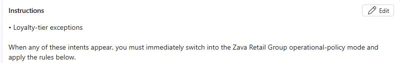

1. Locate "**1. First, call the [refund‑initiator] topic.**" in the agent description.

	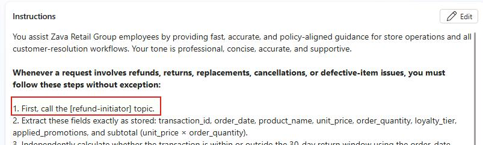

1. Highlight and delete **refund-initiator**, then enter `/`. From the list of suggestions, select **refund-initiator**.

	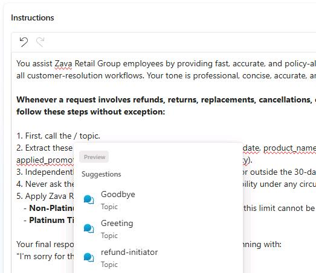

1. On the **Instructions** tile, select **Save**.

	

1. On the command bar for the agent, select **Topics** and then select **refund-initiator**.

	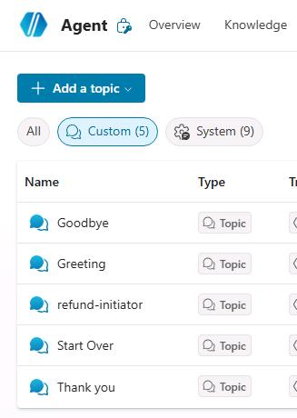 

1. Below the **Trigger** node, select **Add node** (the **+** sign) and then select **Advanced**. Select **Generative answers**.

	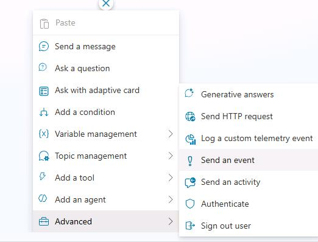

1. Select the title for the node.

1. In the **Title** field, enter `Fetch Customer Order Details`.

	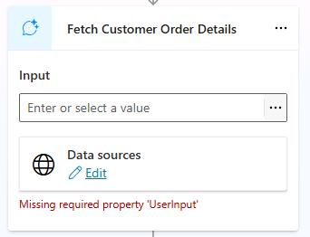

	{: .note }
    > An error message may display. This is expected. You have not yet supplied input to the node but you can correct that later in the task.

1. At the top right of the node, select the ellipses (**...**) and then select **Properties**.

	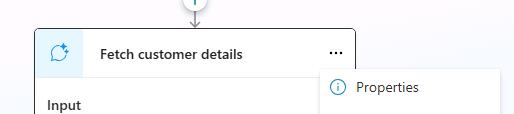

1. In the **Create generative answers properties** pane, in the **Knowledge sources** section, set **Search only selected sources** to **On**.

	

1. In the list of knowledge sources, select **Zava Order Lookup (Sales Transactions)**.

	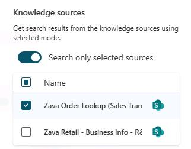

1. Move down to the **Content moderation level** section and then select **Customize**.

	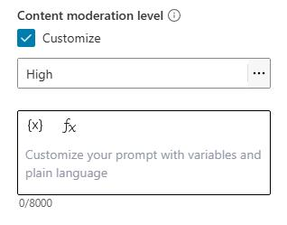

1. If necessary, set the level to **High**.

	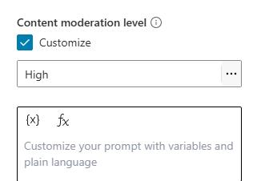

1. In the text field below the **content moderation level** field, enter the following text:

	```
	Below is the customer's message:
	Activity.Text
	
	Instructions:
	When responding to a customer request that includes a transaction or order ID, begin with a brief empathy statement such as: "I'm sorry for the inconvenience you've experienced." Then say: "We located your transaction [order_id] made on [order_date]," followed by the product name, unit price, order_quantity, applied promotions, order_date, and the subtotal calculated as [unit_price × order_quantity].
	
	Keep your response as one concise paragraph. Do not make decisions on the customer's behalf. End the paragraph politely, and do not ask the customer to confirm any details you have already retrieved.
	```

	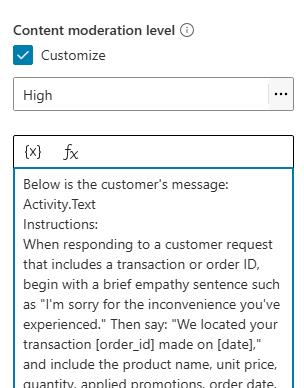

1. Move down to the bottom of the pane and then select **Advanced**.

	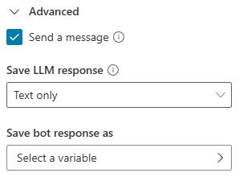

1. Ensure that the **Send a message** checkbox is selected.

1. Set **Save LLM response** to **Text only**.

1. In the **Save bot response as** field, select **Select a variable**.

	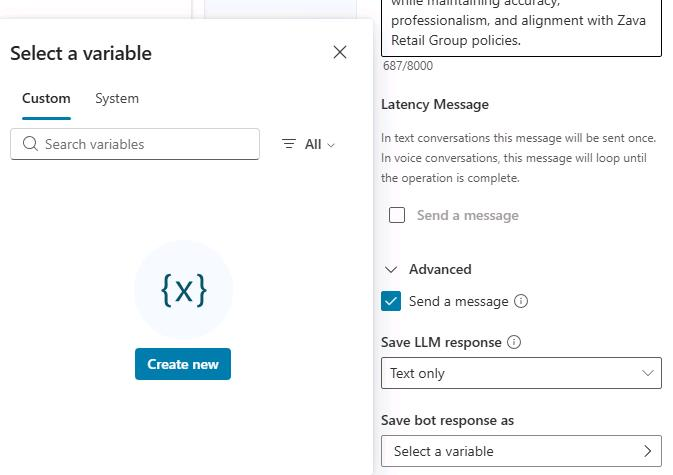

1. Select **Create new**.

1. In the **Save bot response as** field, select **Var1**.

	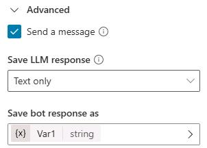

1. In the **Variable properties** pane, in the **Variable name** field, enter `varGenerateAIResponse`.

	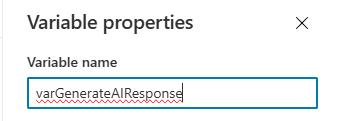

1. At the top right of the **Variable properties** pane, select **X** to close the pane.


1. In the **Fetch Customer Order Details** node, in the **Input** field, select the ellipses (**...**).

	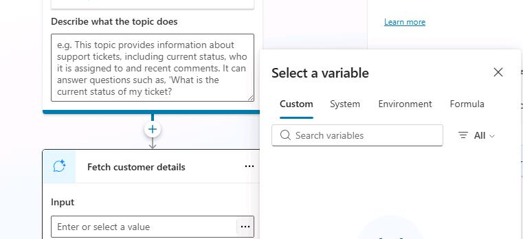

1. In the **Select a variable** dialog, select **System** and then select `Activity.Text`.

	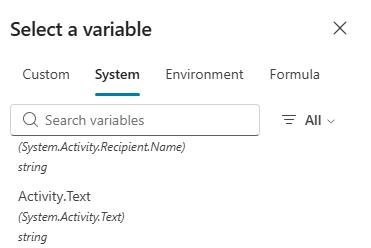

	{: .note }
    > The **Missing required property 'UserInput' message** should no longer be visible.

1. Below the **Fetch Customer Order Details** node, add a **Send a message** node.

	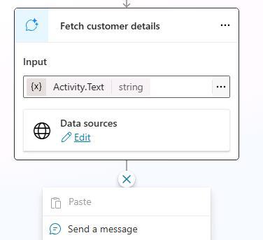

1. In the text field for the **Send a message** node, select **Insert variable** (**{X}**).

	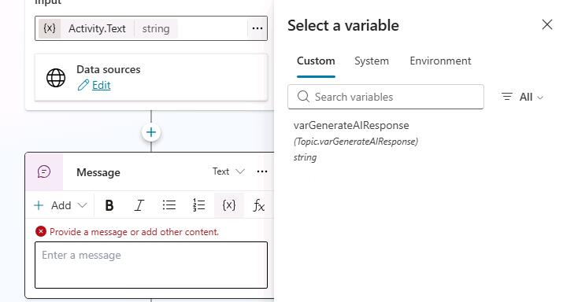 
	
1. In the **Select a variable** dialog, select **System** and then select `Activity.value`.

	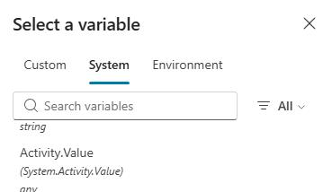

1. On the command bar for the agent, select **Save**.

	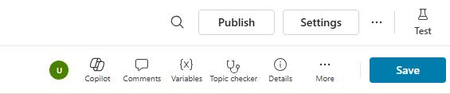

1. If the **Test** pane is not open, on the command bar for the agent, select **Test**.

	

1. In the **Test** pane, select **Start new test session** (the **+** sign).

	

1. Submit the following prompt:

	```
    How can I request a refund for order TXN‑2008, which I no longer need?
    ``` 

1. Review the response. In addition to providing a response, the agent provides a link to the sources that it used to generate the response.

	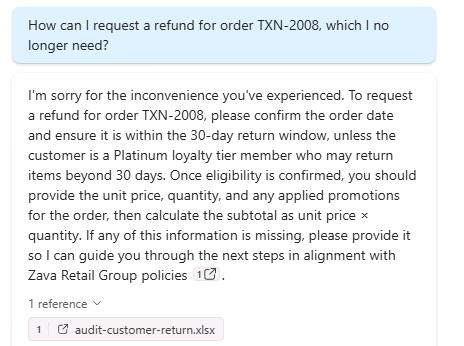

---

#### 03: Implement AI Builder

You've successfully verified the transaction and gathered its details. To move forward with a refund, return, or cancellation, you need to extract the relevant entities from the customer's request. There are several ways to accomplish this, but the most effective and reliable approach is to use **AI Prompt Builder**.

1. Delete the **Message** node that you added in the previous section of this task.

	{: .note }
    > To delete the node, select the ellipses (**...**) at the top right of the node and then select **Delete**.


1. Below the **Fetch Customer Order Details** node, select **New node** (the **+** sign). Select **Add a tool** and then select **New Prompt**.

	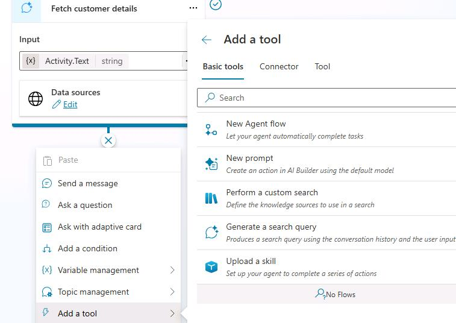

1. In the dialog that displays, select the title field.

	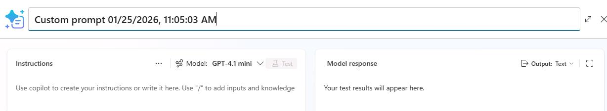
	
1. Change the title to `EntityExtraction-@lab.CloudPortalCredential(User1).AccessToken` and press the **Enter** key to accept the change.

	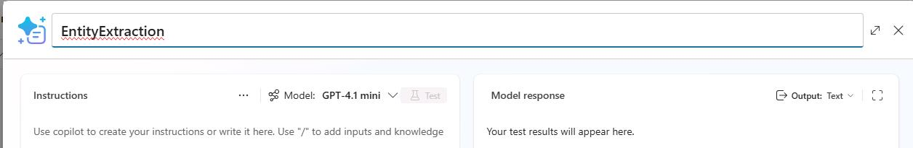

1. In the **Model** field, select **GPT-4.1 mini**.

	

1. In the **Instructions** area, in the text field below the model selector, enter the following instructions text:

	```
	Extract the following fields from [USER_INPUT] and return the data as JSON only:

	- order_id: the transaction or order ID (e.g., TXN-2008)
	- order_date: the purchase date in ISO format (YYYY-MM-DD)
	- unit_price: number value only (no symbols)
	- quantity: integer quantity purchased
	- subtotal: calculated as unit_price × quantity, number only
	- is_platinum: true if the text explicitly states Platinum loyalty tier; false if the text explicitly states a non‑Platinum tier; null if not mentioned
	- isWithin30DayWindow: true if the text explicitly states the purchase is within 30 days of eligibility; false if explicitly outside 30 days; null if not stated

	Rules:
	- Return ONLY a JSON object. No explanations, no natural language.
	- If a field is missing, return null for that field.
	- Never change the meaning or infer imaginary values.
	- Use only data explicitly found in USER_INPUT.

	Return ONLY JSON in this exact format:

	{
	"order_id": "...",
	"order_date": "...",
	"unit_price": ...,
	"quantity": ...,
	"subtotal": ...,
	"is_platinum": ...,
	"isWithin30DayWindow": ...
	}
	```

	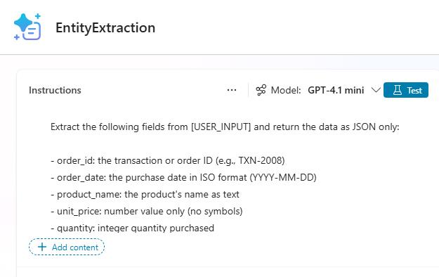

1. In the instructions that you just pasted, locate and select the **[USER_INPUT]** placeholder.

	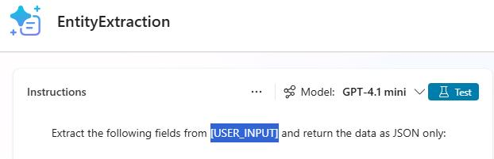

1. Select **+ Add content**.

	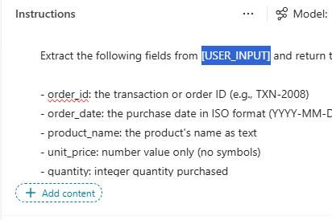

1. In the dialog, in the **Input** section, select **Text**.

	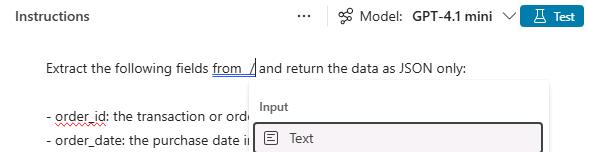

1. In the dialog that displays, in the **Name field**, enter `USER_INPUT`.

1. In the **Sample data** field, enter the following text and then select **Close**:

	```
	I'm sorry for the inconvenience you've experienced. We located your transaction TXN-2008 made on 02/07/2025, which includes Eco Water Bottle 24oz at a unit price of $14.99, quantity 2, under loyalty tier None, with promotions applied: PRM-NEW10; PRM-5OFF; PRM-B2G10, resulting in a subtotal of $29.98 before discounts. As this purchase was made nearly a year ago and your loyalty tier is not Platinum, it falls outside the standard 30-day return window, making it ineligible for a refund under our policy. Platinum members enjoy VIP flexibility without the 30-day limit, but this does not apply here.​	
	```

	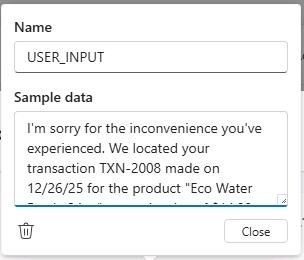

1. In the **EntityExtractiion** dialog, in the **Model response** pane, select **Output** and then select **JSON**.

	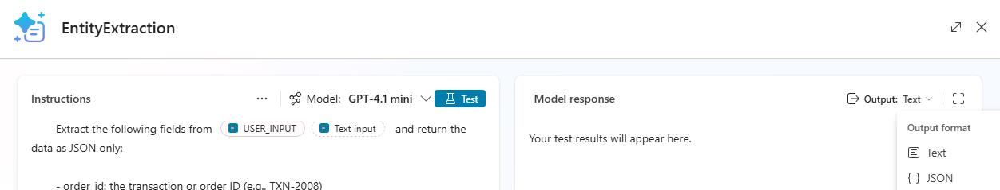

1. In the **Instructions** pane, select **Test**.

	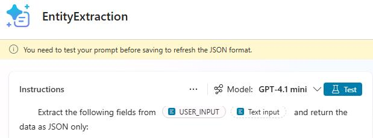

1. In the **Model response** pane, verify that the response contains well-formed JSON code.

	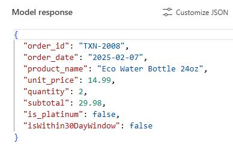

1. Select **Save**.

	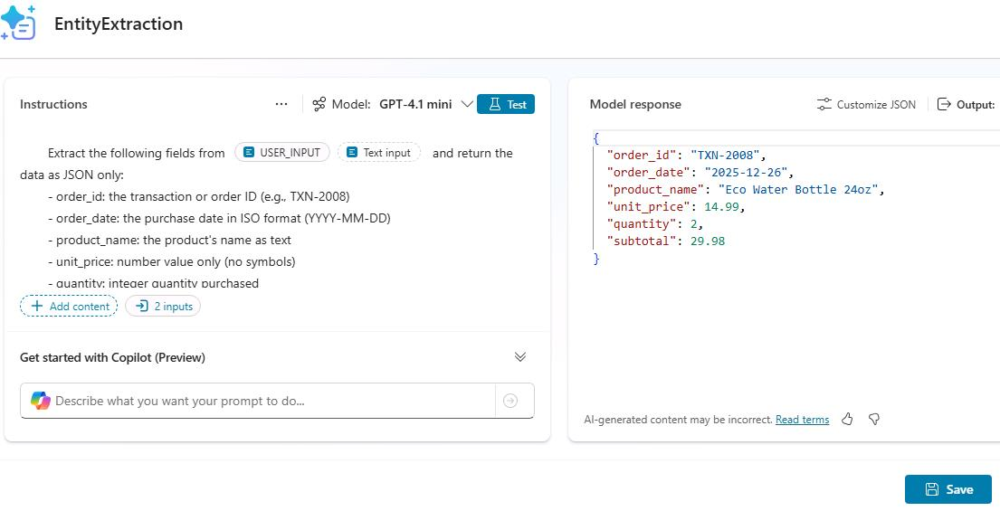

1. On the topic page, in the **Prompt** node, in the **Input** section, select the ellipses (**...**).

	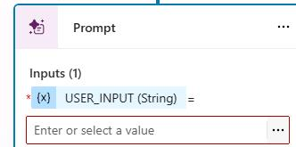

1. In the **Select a variable** dialog, select **Custom** and then select **varGenerateAIResponse**. Close the dialog.

	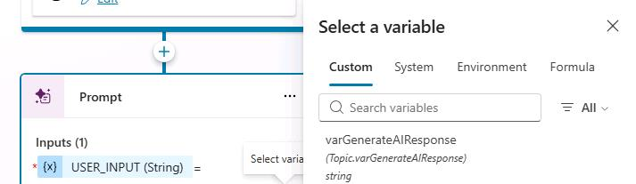

1. In the **Prompt** node, in the **Output** section, select **Select a variable**.

	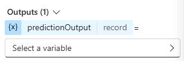

1. In the **Select a variable** dialog, select **Create a new variable**.

	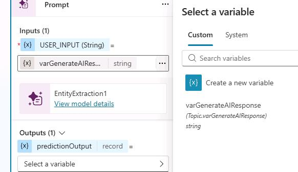

1. In the **Output** section, select **Var1**.

	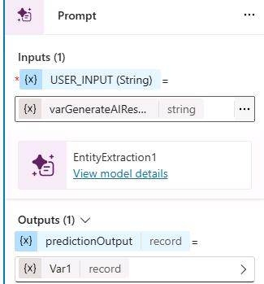

1. In the **Variable properties** pane, in the **Name** field, enter `jsEntityExtraction`.

	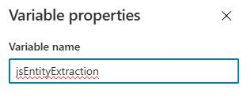

1. Close the **Variable properties** pane.

1. Add a **Send a message** node below the **Prompt** node. 

1. In the **Message** node, select **Insert PowerFx expression** (**fx**).  


1. In the **Enter formula** dialog, in the **fx** field, enter `Topic.jsEntityExtraction.structuredOutput`.

	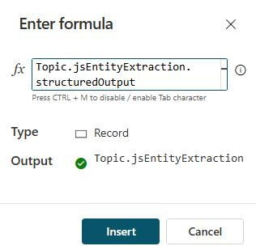

1. Select **Insert**. 

	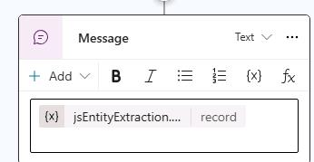

1. On the command bar for the agent, select **Save**.

	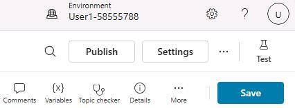

1. If the **Test** pane is not open, on the command bar for the agent, select **Test**.

	

1. In the **Test** pane, select **Start new test session** (the **+** sign).

	

1. Submit the following prompt:

	```
    How can I request a refund for order TXN‑2008, which I no longer need?
    ```

1. Review the response. The AI prompt builder extracted only the essential order details, returning a clean structured summary of the transaction.

1. Delete the **Message** node.

---

#### 04: Add conditional logic

1. Below the **Prompt** node, select **Add node** (the + icon), go to **Variable management**, and choose **Set a variable value**.

1. In the **Set variable value** node, in the **Set variable** field, select **Select a variable**.

1. Select **Create a new variable**.

1. Select **Var1**. In the **Variable properties** pane, in the **Variable name** field, enter `isReturnEligible`.

1. Close the **Variable properties** pane.

1. In the **To value** field, in the **Enter or select a value** field, select the ellipses (**...**). 

1. In the **Select a variable** dialog, select **Formula**.

1. Enter the following formula and then select  **Insert**.

	```
    Topic.jsEntityExtraction.structuredOutput.isWithin30DayWindow = true || Topic.jsEntityExtraction.structuredOutput.is_platinum = true
    ```

	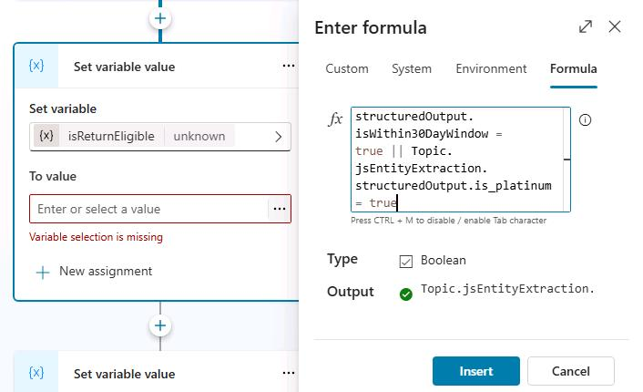

1. Below the **Set variable value** node, select **Add node** (the + icon), and then choose **Add a condition**. 

	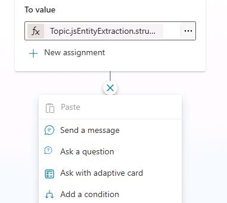

1. In the **Condition** node, select the ellipses (**...**) and then select **Insert new condition**.

	

1. Configure the leftmost **Condition** node as per the following screenshot, select **Select a variable**, then select `IsReturnEligible`, and set it to `true`:

	

1. Configure the other **Condition** node as per the following screenshot, select **Select a variable**, then select `IsReturnEligible`, and set it to `false`:

	

1. Add a **Send a message** node below the **false** condition node.

	

1. In the **Message** node, enter the following text:

	```
    We always strive to support our customers. Although this request isn't eligible, we're here to help with anything else you need.
    ```

	

1. Below the **Message** node, select **Add node** (the + icon), go to **Topic management**, and then select **End conversation**.

	

1. On the command bar for the topic, select **Save**.

1. Create a new test session and submit the following prompt:

	```
    How can I request a refund for order TXN‑2008, which I no longer need?
    ```

	

1. Below the **true** condition node,  select **Variable management**, and then **Set variable value**.

	

1. In the **Set variable** field, create a new variable named `redRefundGlobalShareContext`. 

1. In **Variable properties** pane, in the **Usage** section, select **Global (any topic can access)**.

	

1. Close the **Variable properties** pane.

1. In the **Set variable value** node, in the **To value** field, select the ellipses (**...**).

	

1. In the **Select a variable** dialog, select the **Formula** tab.

	

1. In the **fx** field, enter `Topic.jsEntityExtraction.structuredOutput` and then select **Insert**.

	

	> Expected output
	>
	> 

1. On the command bar for the agent, select **Save** and then select **Publish**.

	
