## Task 03: Build a topic that confirms cancellation, collects issue details, saves the record, and returns a confirmation ID

### Introduction

Zava’s COE must show that agents can move from analysis to action while maintaining control over user experience and data handling. Refund submission is a practical example of an enterprise workflow: confirm intent, capture structured inputs, write the record to a system of record, and provide an auditable confirmation identifier.

### Description

In this task, you'll build the refund-submission topic and connect it to refund-initiator for a clean workflow handoff. You'll implement an adaptive card to collect structured inputs, then use an Agent Flow to generate a confirmation ID and write the refund request to an Excel table stored in SharePoint. The topic returns the confirmation number to the user in a consistent, business-ready message.

### Success criteria

- A topic named refund-submission exists and is configured as a redirect topic that can be invoked from refund-initiator.
- The confirmation question correctly injects order values from the shared global context variable (order ID and order date).


### Key steps

#### 01: Create the topic

1. On the command bar for the agent, select **Topics**.

	

1. On the **Topics** page, on the command bar, select **Add a topic** and then select **From blank**.

	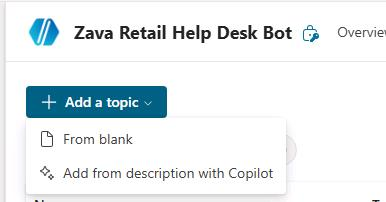

1. Change the name from **Untitled** to `refund-submission` and then press the **Enter** key to save the change.

	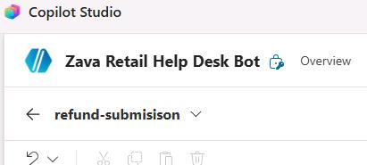

1. In the **Trigger** node, hover the mouse cursor over the text **The agent chooses** and then select **Change trigger**.

	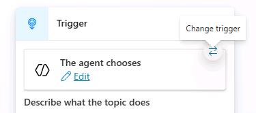

1. In the **Change trigger** dialog, select **It's redirect to**.

	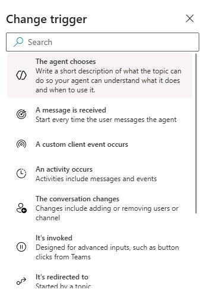

1. Below the **Trigger** node, select **Add node** (the **+** sign) and add an **Ask a question** node.

	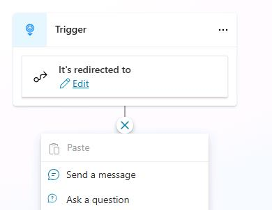

1. In the **Enter a message** field, enter the following text:

	```
	Please note that canceling transaction [order_id] from [order_date] is permanent and can't be undone. Before you proceed, do you want to continue with this cancellation?
	```

1. Highlight and delete [order_id] from the text. 

1. Select **Insert Power fx expression**.

1. In the **fx** field, enter `Global.redRefundGlobalShareContext.order_id`.

1. Highlight and delete [order_date] from the text. 

1. Select **Insert Power fx expression**.

1. In the **fx** field, enter `Global.redRefundGlobalShareContext.order_date`.

	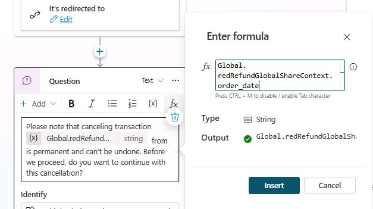

1. In the **Option for user** section, select **New option**.

	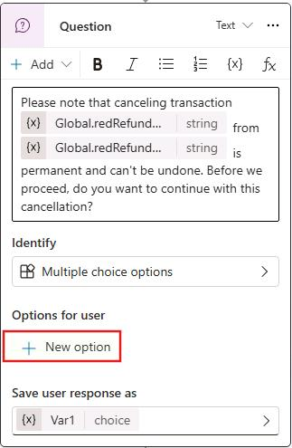

1. In the **Enter option** field, enter `Yes` and then press the **Enter** key.

1. Repeat Steps 14-15 to create a `No` option.

	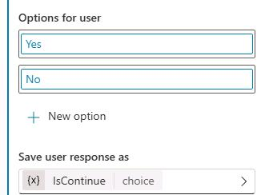

1. In the **Save user response as** field, select **Var1**.

1. In the **Variable properties** pane, in the **Variable name** field, enter `IsContinue`.

	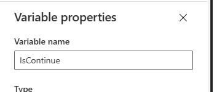

1. Close the **Variable properties pane**.

---

#### 02:  Configure the **Yes** option

When the customer selects **Yes**, the agent should proceed with the refund or cancellation process.

1. On the topic canvas, move down to the **Condition** nodes. Below the **Yes** node, select **Add node** (the **+** sign). 

	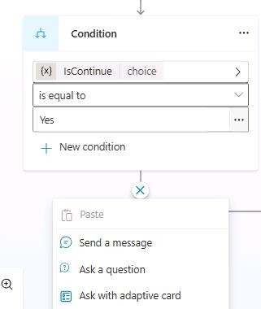

1. Select **Ask with adaptive card**.

	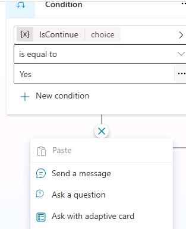
	
	
1. In the **Adaptive Card** node, select the ellipses ((**...**)) and then select **Properties**.


1. In the **Adaptive Card Node properties** pane, select **Edit adaptive card**.

	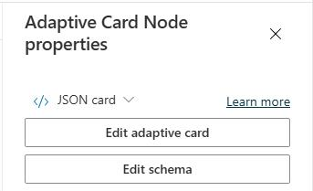


1. In the **Card payload editor** pane, delete the existing code. Then, paste the following code into that pane:

	```
	{
	"$schema": "http://adaptivecards.io/schemas/adaptive-card.json",
	"type": "AdaptiveCard",
	"version": "1.6",
	"body": [
		{
		"type": "TextBlock",
		"text": "Zava Retail Refund Request Form",
		"weight": "Bolder",
		"size": "Large",
		"wrap": true
		},

		{
		"type": "FactSet",
		"facts": [
			{
			"title": "Order ID:",
			"value": "${Topic.OrderId}"
			},
			{
			"title": "Order Date:",
			"value": "${Topic.OrderDate}"
			},
			{
			"title": "Unit Price:",
			"value": "${Topic.UnitPrice}"
			},
			{
			"title": "Quantity:",
			"value": "${Topic.Quantity}"
			}
		]
		},

		{
		"type": "Input.Text",
		"id": "Requester",
		"label": "Requester Name",
		"placeholder": "Enter your name",
		"isRequired": true,
		"errorMessage": "Requester name is required."
		},
		{
		"type": "Input.Text",
		"id": "Reason",
		"label": "Reason for Refund",
		"placeholder": "Describe the reason for the refund",
		"isMultiline": true,
		"isRequired": true,
		"errorMessage": "Refund reason is required."
		}
	],
	"actions": [
		{
		"type": "Action.Submit",
		"title": "Submit Refund Request"
		}
	]
	}
	```

1. Select **Save** and then select **Close**.

	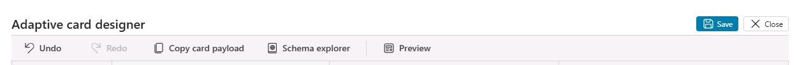
	
1. In the **Adaptive Card Node properties** pane, select **JSON card** and then select **Formula**.

	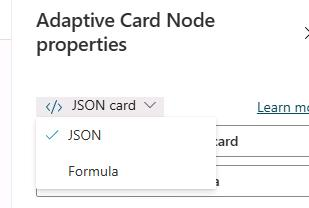

1. In the **Formula** field select **Expand**.

	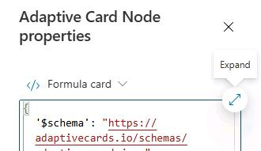

1. Place your cursor in the **Formula** field and then press the **Ctrl** **F** key combination.

1. In the **Find** field, search for `type: "FactSet"`

1. Locate the following values in the code and then replace them with the values shown below:

	| Value to replace | New value |
	|---------|---------|
	| "${Topic.OrderId}"   | `Global.redRefundGlobalShareContext.order_id`  |
	| "${Topic.OrderDate}"  | `Global.redRefundGlobalShareContext.order_date`   |
	| "${Topic.UnitPrice}"  | `Global.redRefundGlobalShareContext.unit_price`   |
	| "${Topic.Quantity}"   | `Global.redRefundGlobalShareContext.quantity`   |

	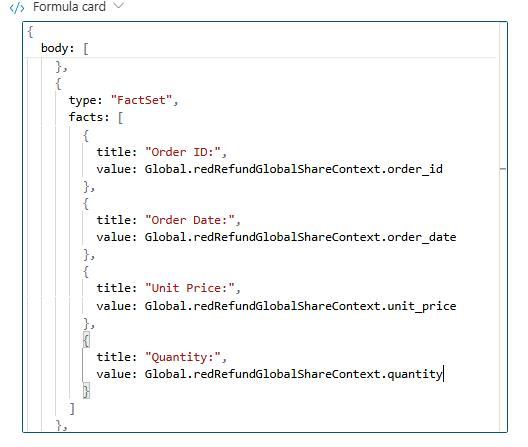

1. Select **Save**.

---

#### 03: Configure the **No** option

When the customer selects **No**, the agent should stop the refund process and exit or redirect to the appropriate next step.

1. Under the **Condition** node where its set to **No** add a **Send a message** node.

	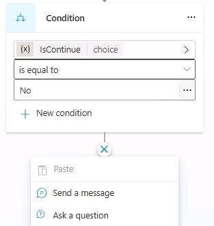

1. Select the text area, then type: 

    ```
    Great news - your order [order_id] from [date] will remain active. If you have any additional questions, feel free to ask.
    ``` 

1. Highlight [order_id] from the text, delete it then select **Insert Power(Fx) expression**. Enter the following expression and then select **Insert**:
	
	```
    Global.redRefundGlobalShareContext.order_id
    ```

	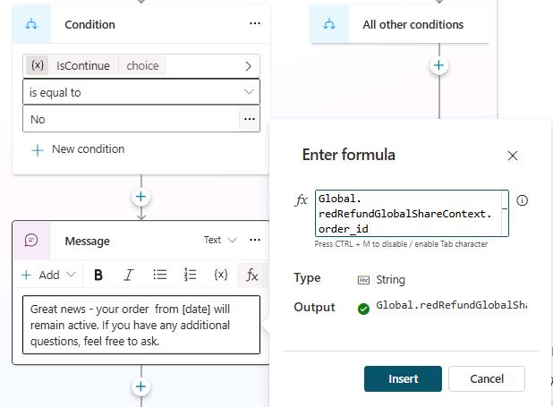

1. Highlight [order_date] from the text, select **Insert Power(FX) expression**, then press **Insert** to replace it with:

    ```
    Global.redRefundGlobalShareContext.order_date
    ```

	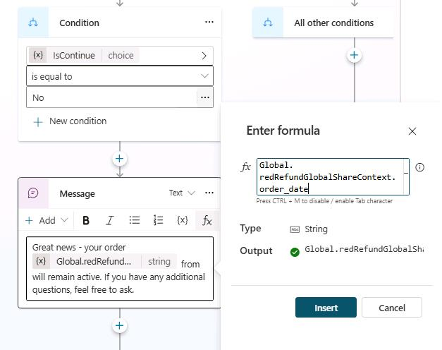

1. Below the **Message** node that you just created, select **Add node**, select **Topic management**, and then **End conversation**.

	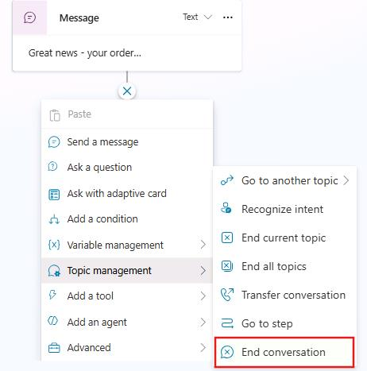

1. Select **Save**.

---

#### 04: Define triggering behavior
It's time to define how one topic will trigger another, ensuring the handoff follows the business context of each request.

1. Open the **refund-initiator** topic. Locate the **Set variable value** node for the **True** condition. 

	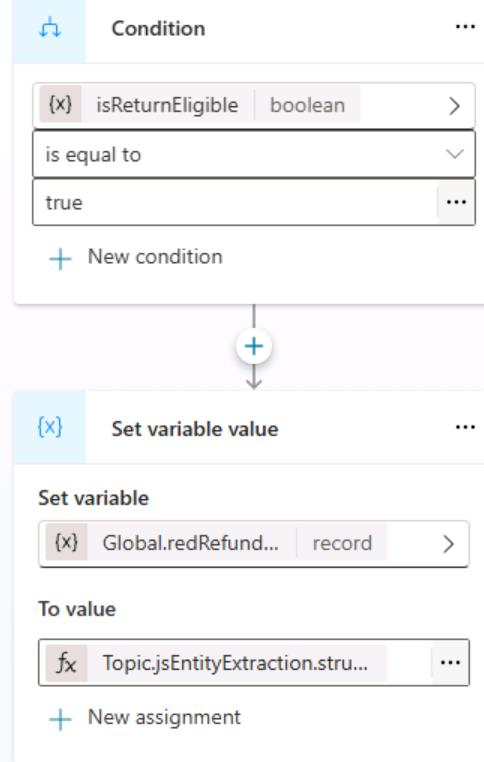

1. Below **Set variable value** node, select **Add node**.

1. Select **Topic management**, and then **Go to another topic**. Search for and select `refund-submission`.

	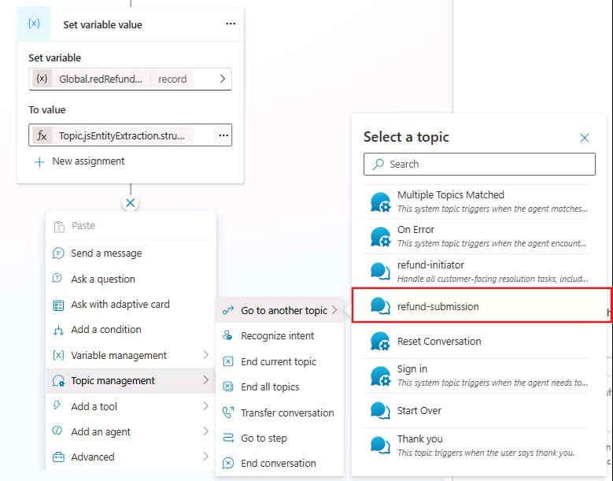

1. Select **Save**.

1. Start a new test session and submit the following prompt:

	```
    How can I request a refund for order TXN-2098, which I no longer need?
    ```

	{: .note }
    > The agent redirects you from the refund‑initiator topic to the refund‑submission topic to continue the refund process, then waits for your confirmation before proceeding.

	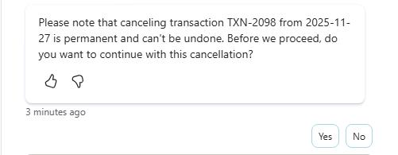

1. Select **Yes** and observe how the adaptive card displays certain variable values in read‑only mode, while allowing the end user to enter the complaint details.

	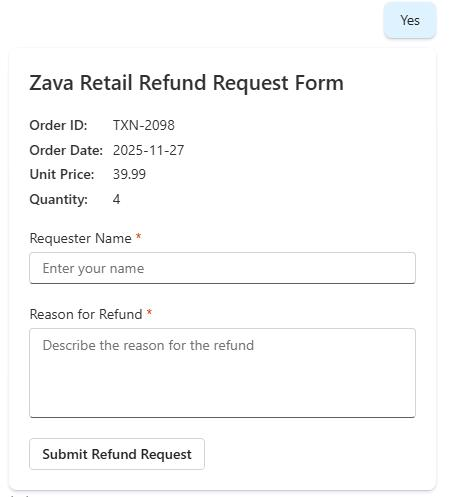

1. Now let us test the **No** condition option, first select **Start a new session** then prompt:

    ```
    How can I request a refund for order TXN‑2008, which I no longer need?
    ```

	{: .note }
    > Notice how the agent clearly rejects the request while still offering support for anything else the customer may need.

	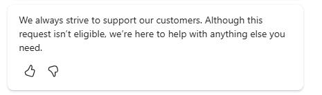

#### 04: Create an AgentFlow

1. Open the **refund-submission** topic.

1. Move down to locate the **Adaptive Card** node.

1. Below the node, select **Add node**, select **Add a tool**, and then select **New Agent flow**.

	

1. Select **When an agent calls the flow** and then select **+ Add an input**.

1. In the left field, select **Text**, enter `OrderId`.

	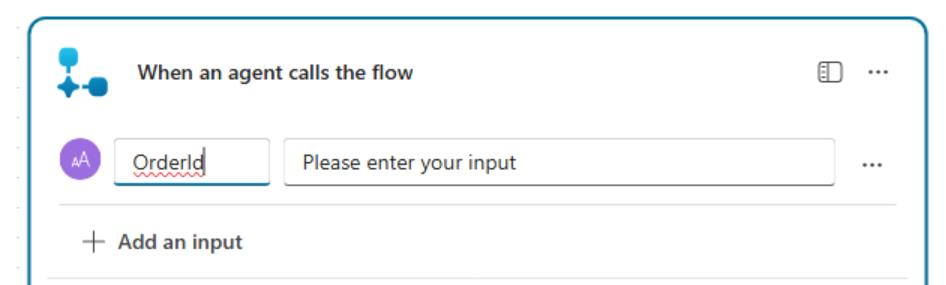

1. Repeat Steps 3-5 to add these additional inputs:

	| Value | Data type |
	|---------|---------|
	| `OrderDate`   | **Date**   |
	|`UnitPrice` |**Number**|
	| `Quantity`   | **Number**   |
	| `Requester`   | **Text**  |
	| `Reason`  | **Text**  |

	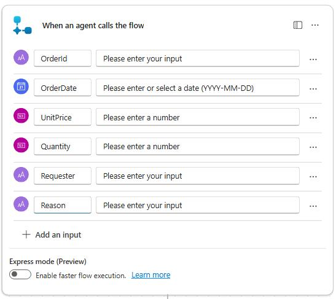

1. Below the **When an agent calls the flow** node, select **Add an action** (**+**).


1. Search for and select `Initialize variable`. 

	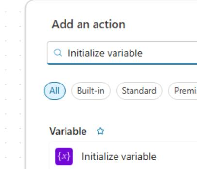

1. At the top right of the action, select the ellipses and then select **Rename**.


1. Rename it to `Generate Unique Request ID`.

	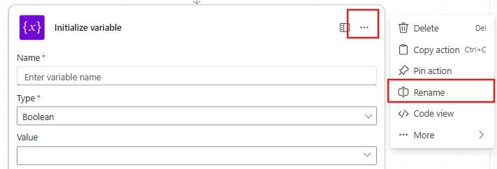

1. Configure the node by using the following information:

	| column 1 | column 2 |
	|---------|---------|
	| Name   | `ConfirmationId`  |
	| Type   |  String  |

1. In the **Value** field, select **fx** then enter:

    ```
    concat('req-', formatDateTime(utcNow(), 'MMddyyHHmmss'))
    ```
    
    Then, select **Add**.

	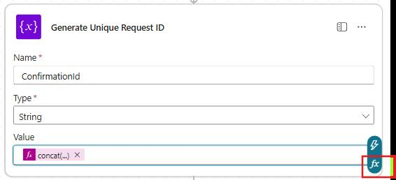

1. Add a new `Initialize variable` action below the **Generate Unique Request ID** action. Rename the action to `Compose - Submission Timestamp`.

1. Configure the action by using the following information:

	| column 1 | column 2 |
	|---------|---------|
	| Name   | `getSumissionDateTime`   |
	| Type   |  String  |

1. In the **Value** field, select **fx** then enter:

    ```
    formatDateTime(utcNow(), 'yyyy-MM-dd HH:mm:ss')
    ```
    
    Then, select **Add**.

	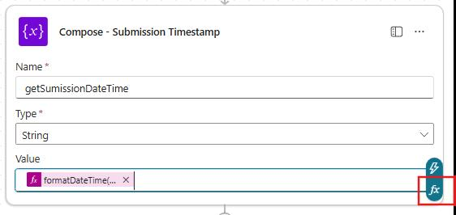


1. Below the **Compose - Submission Timestamp** action, add an `Add a row into a table` excel action.
	
    {: .note }
    > Be sure to select the **Excel Online (Business)** option.

	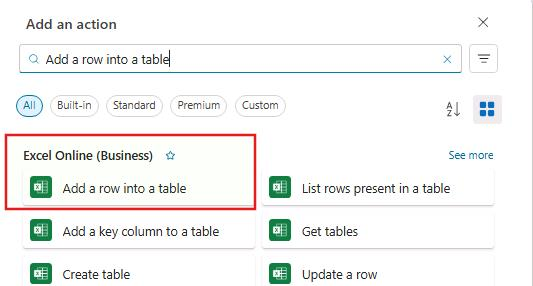

1. Select **Sign in**. If prompted, sign in by using the following credentials:

    | Item | Value |
    | ---- | ----- |
    | Username | `@lab.CloudPortalCredential(User1).Username` |
    | Temporary Access Pass (TAP) token | `@lab.CloudPortalCredential(User1).AccessToken` |

1. Select **Allow access**.

	

1. Enter the following details:

    - **Location:** `SharePoint Site - Zava Retail Data`
    - **Document Library:** `Documents`
    - **File:** `/SharePointFiles/returnitems/audit-customer-return.xlsx`
    - **Table:** `CustomerReturn`

	

1. In the **Advanced parameters** section, select **Show all**.

1. Delete **DateTime Format:** by selecting **X** and configure these columns by using the following information: 

    | Item | Value |
    | ---- | ----- |
    | **ConfirmationId** | `ConfirmationId` |
	| **OrderId** | `OrderId` |
	| **OrderDate** | `OrderDate` |
	| **UnitPrice** | `UnitPrice` |
	| **Quantity** | `Quantity` |
	| **RequestDate** | `getSumissionDateTime` |
	| **Requester** | `Requester` |
	| **Reason** | `Reason` |

	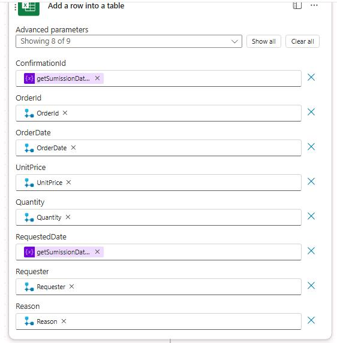

1. Select the **Respond to the agent** then select **+ Add an output**.

	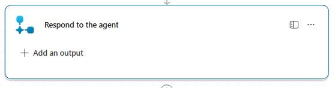

1. Select **Text** then name it `ConfirmationNumber` then set value to  **ConfirmationId**.

	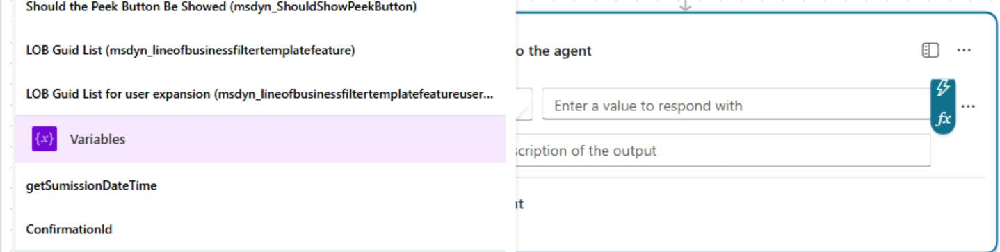

1. Select **Save draft**.

1. Change the name from **agentflow** to `Customer Return Request Processor` and then select **Publish**.

	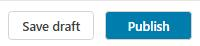

---

#### 05: 

1. Open the **Zava Retail Help Desk Bot**. Select **Topics** and then select **refund-submission**.

1. Refresh the page. Locate the **Adaptive Card** node.

1. Below the node, select **Add node**. Select **Add a tool** and then select **Customer Return Request Processor**.

	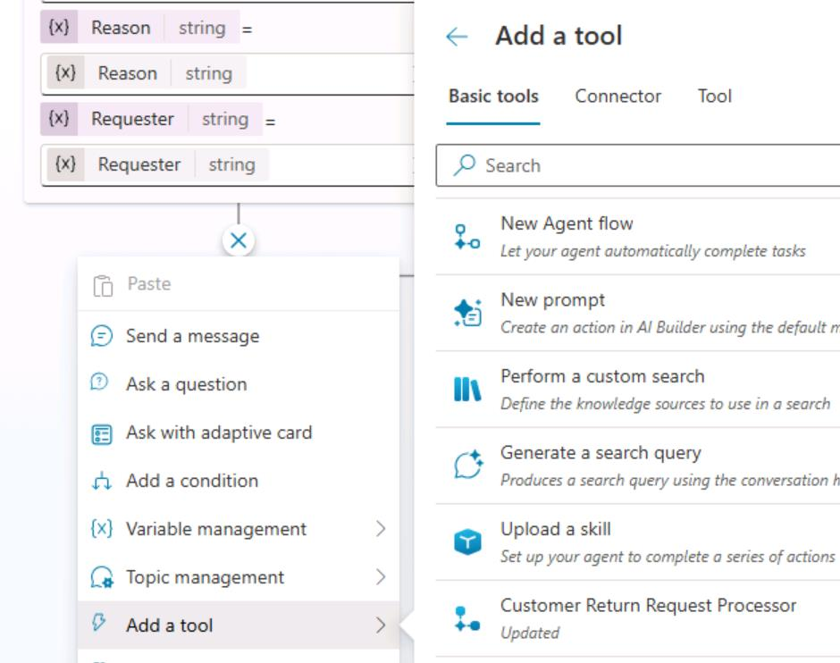

1. Configure the **Action** node using the information provided. In the **Enter or select a value** field, select the **ellipsis (…)**, choose **Formula**, and enter the corresponding expression for each item.:

	| Field | Formula |
	|---------|---------|
	| OrderId   | `Global.redRefundGlobalShareContext.order_id`  |
	| OrderDate   |`Global.redRefundGlobalShareContext.order_date`   |
	| UnitPrice  | `Global.redRefundGlobalShareContext.unit_price`  |
	| Quantity   |`Global.redRefundGlobalShareContext.quantity`  |


    - For the **Requester** variable, select **Requester**.
    - For the **Reason** variable, select **Reason**.

	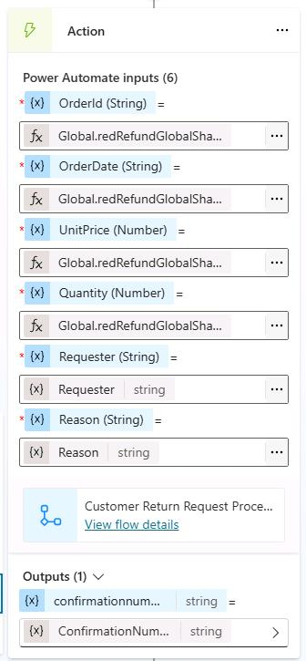

1. Add a **Send a Message** node below the **Action** node you just configured.

1. Enter the following text in the message field:

	```
	We're sorry to hear that you need to cancel your order. Your cancellation has been successfully processed, and your confirmation number is [insert confirmation number]. If you have any other questions or need further assistance, please don't hesitate to contact us-we're here to help.
	```

1. Highlight and delete **[insert confirmation number]**,leave the cursor on the same place then select **{x}** then select `ConfirmationNumber`.

	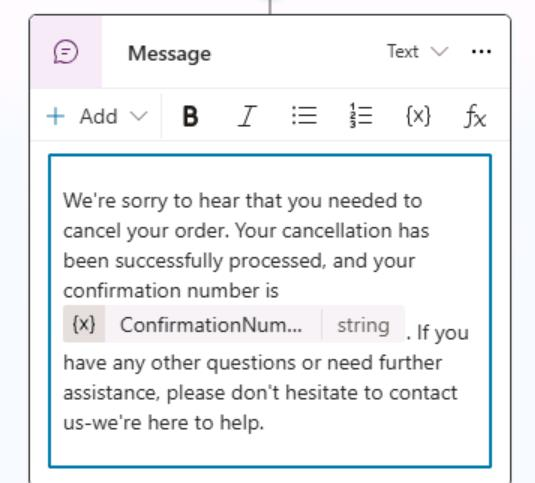

1. Select **Save**.

1. Start a new test session and submit the following prompt:

	```
    How can I request a refund for order TXN-2098, which I no longer need?
    ```

1. Select **Yes** and follow the instructions. Enter the following information when prompted:

	- **Requester Name:** `Alex Rivera`
	- **Reason for Refund:** `Received the wrong item. Order included a different product than what was purchased.`

1. Select **Submit Refund Request**, and then select **Allow** to save the request details to the Excel table. 

	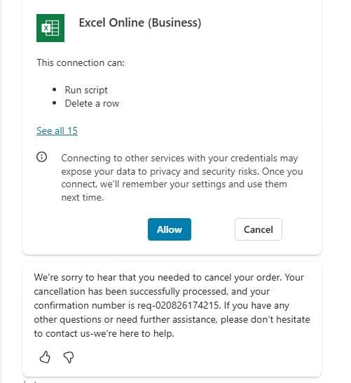

1. Verify that the record was inserted successfully by opening a new browser tab and entering the following URL: 

    ```
    https://lodsprodmslearnmca.sharepoint.com/sites/Zava-Retail-Data@lab.LabInstance.Id/Shared%20Documents/SharePointFiles/returnitems/
    ```

1. If prompted, sign in by using the following credentials:

    | Item | Value |
    | ---- | ----- |
    | Username | `@lab.CloudPortalCredential(User1).Username` |
    | Temporary Access Pass (TAP) token | `@lab.CloudPortalCredential(User1).AccessToken` |

1. Select `audit-customer-return.xlsx` to access the refund detail record.

	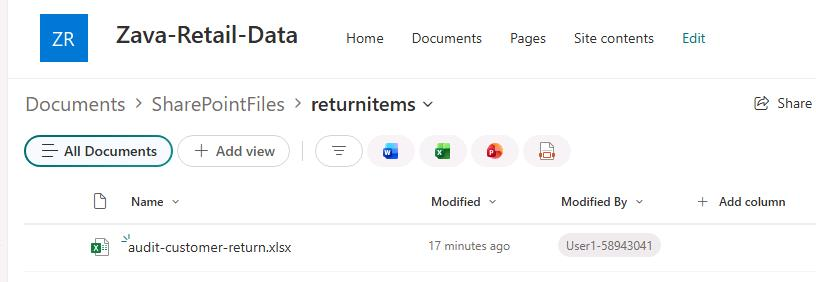