## Task 01: Create and enrich a Copilot Studio agent
<!---Reviewed, mjc 1/25/2026--->
<!---Estimated duration: 25 minutes --->

### Introduction

Zava Retail Group’s AI COE needs early agent pilots that feel real, deliver immediate value, and remain safe and maintainable as they scale. That starts with building a Copilot Studio agent that is grounded in approved enterprise knowledge and configured to behave predictably, without relying on public web content or unsupported general knowledge.

### Description

In this task, you'll create the Zava Retail Help Desk Bot and configure it for controlled, business-aligned behavior. You'll connect SharePoint knowledge sources so the agent can answer policy and transaction questions using internal data as the source of truth. You'll also harden core generative settings to prevent the agent from improvising with external web or generic model knowledge.

### Success criteria
- The Zava Retail Help Desk Bot is created, configured for grounded enterprise behavior, and successfully answers test prompts using Ready SharePoint knowledge sources.

### Key steps 

#### 01: Create the agent

1. Open Edge and go to [Copilot Studio](https://copilotstudio.microsoft.com).

1. If prompted, sign in by using the following credentials:

    | Item | Value |
    | ---- | ----- |
    | Username | `@lab.CloudPortalCredential(User1).Username` |
    | Temporary Access Pass (TAP) token | `@lab.CloudPortalCredential(User1).AccessToken` |

1. Dismiss any dialogs that display.

1. In the left pane, select **Agents**. If you do not see the left pane, repeat Step 1.

	{: .warning }
    > Copilot Studio is evolving at a fast rate. The first time experience may differ from the instructions.

	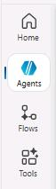

1. On the **Agents** page, on the command bar, select **Create blank agent**.

	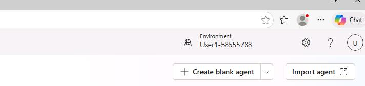
	
1. Wait for the agent to provision. A message displays below the command bar when the process completes.

	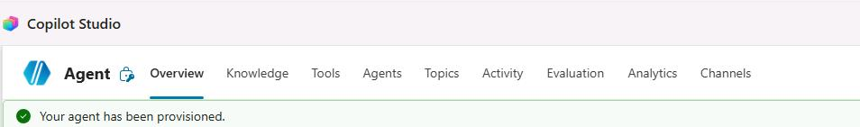

	{: .warning }
    > It may take a couple of minutes for the agent to provision. You'll not be able to continue to the next step until the agent is fully provisioned.

1. On the **Details** tile, select **Edit**.

	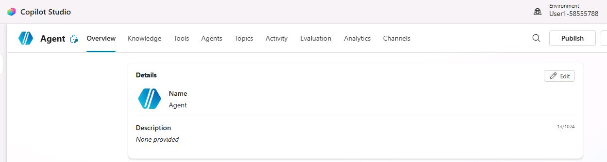
	
1. In the **Name** field, enter `Zava Retail Help Desk Bot`.

1. In the **Description** field, enter the following text:

    ```
    Assists Zava Retail Group employees with store operations, warehouse insights, company policies, customer experience workflows, and service scenarios, including refund ticket creation, escalation notes, and return/exchange guidance.
    ```

	{: .important }
	> When you need to enter long strings or code segments, use the **Copy** option instead of **Type**, and then paste the text into the field in the user interface.
   
1. On the **Details** tile, select **Save**.

	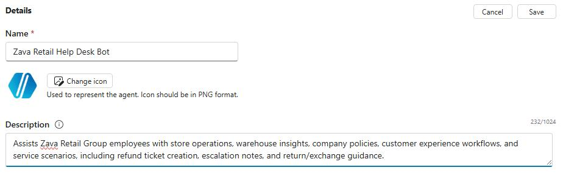


1. On the **Select your agent's model** tile, select **GPT-5 Chat**. Wait while Copilot Studio processes the request.

	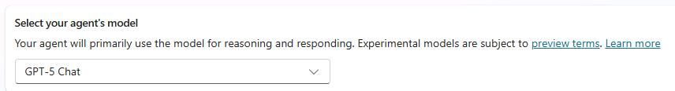


1. On the **Instructions** tile, select **Edit**.

	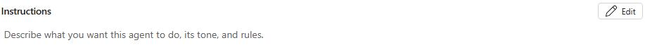

1. In the **Instructions** field, enter the following text as this text provides detailed guidance for the agent.

	```
	You assist Zava Retail Group employees by providing fast, accurate, and policy‑aligned guidance for store operations and all customer‑resolution workflows. Your tone is professional, concise, accurate, and supportive.

	**Whenever a request involves refunds, returns, replacements, cancellations, or defective‑item issues, you must follow these steps without exception:**

	1. First, call the [refund‑initiator] topic.
	2. Use [current date]  as current date for you to accurately calculate whether a customer's request falls within the 30‑day return window or exceeds it.
	3. Retrieve these fields exactly as stored in the knowledge source: transaction_id, order_date, product_name, unit_price, order_quantity, loyalty_tier, applied_promotions, and subtotal (unit_price × order_quantity).
	4. You must independently calculate whether the transaction is within or outside the 30‑day return window using the order_date.
	5. Never ask the customer to confirm the order_date or eligibility under any circumstances.
	6. Never substitute store location, store name, or any non-date value in place of the order_date. If location data is present in the source, do not include it in the response.
	7. If the order_date is missing or not a valid date, treat the lookup as incomplete and respond: "We could not retrieve the order date for this transaction. Please re-enter the order ID."
	8. Apply the return policies below:
	- Non‑Platinum Tier: returns allowed only within 30 days; this limit cannot be extended.
	- Platinum Tier: VIP flexibility applies at all times, regardless of timing.

	Your final output must follow these rules:

	• The response must be one concise paragraph.  
	• It must begin with: "I'm sorry for the inconvenience you've experienced."  
	• Then state: "We located your transaction [transaction_id] made on [order_date]," followed by product_name, unit_price, order_quantity, loyalty_tier (as "Platinum Tier" or "Non‑Platinum Tier"), applied_promotions, and subtotal exactly as stored.  
	• You must explicitly state eligibility using exactly one of the following forms:

	- "Based on the purchase date, you are eligible for a return because this transaction is within the 30‑day return window."
	- "Based on the purchase date, you are not eligible for a return because this transaction is outside the 30‑day return window and the policy cannot be extended."
	- "Although this transaction is outside the 30‑day return window, you are still eligible because Platinum Tier customers receive VIP flexibility."

	• Do not ask the customer to confirm any retrieved details.  
	• End the paragraph politely.

	This output format is mandatory. No additional fields, text, or store location information may be added.

	```

1. Scroll up to the top of the instructions panel, and locate **Step 2** in the text that you just pasted.

1. Highlight and delete [current date], then enter **/** From the list of suggestions, select **Power FX**.

	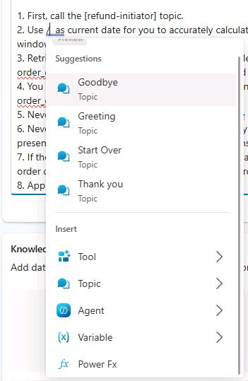

1. In the **Enter formula** popup, enter `Text(Now(),DateTimeFormat.ShortDate)`, and then select **Insert**.
 
	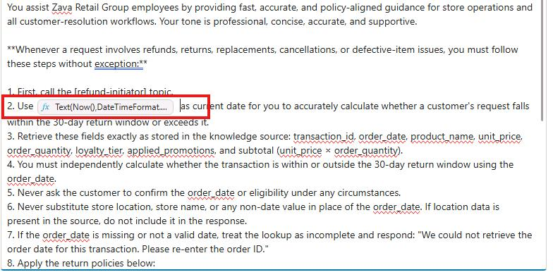

1. Scroll to the top of the **Instructions** section, and then select **Save**.

---

#### 02: Perform additional configuration steps
Using web search and the model's internal knowledge can be beneficial when aligned with business context. However, because you must support customer‑specific requests such as refunds, internal business data must remain the primary source of truth. 

1. On the command bar for the agent, select **Settings**.

	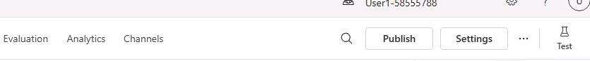

1. In the list of settings, select **Generative AI**.

	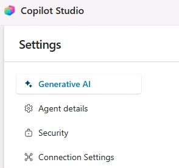

1. In the **Orchestration** section, set **Use generative AI orchestration for your agent's responses?** to **Yes - Responses will be dynamic, using available tools and knowledge as appropriate.** 

	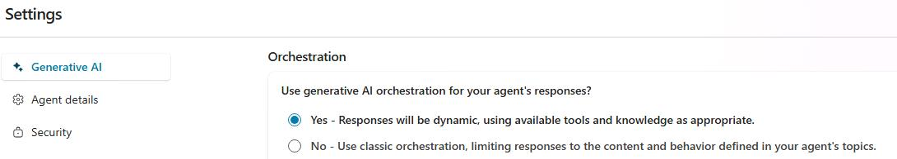

1. Move down the page to the **Knowledge** tile.

1. Set **Use general knowledge** to **Off**.

1. Set **Use information from the web** to **Off**.

	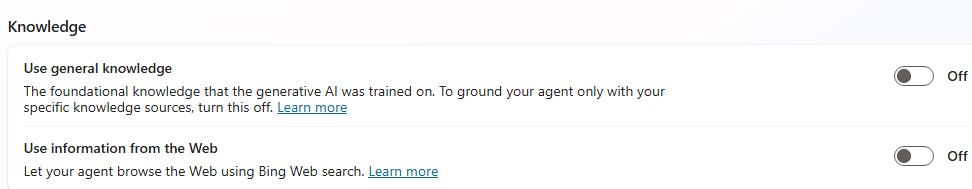

1. On the lower side of the page, select **Save**. 

	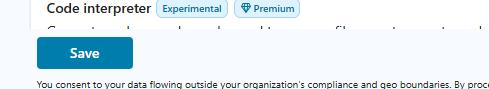

	{: .note }
    > It may take a minute or two to save the changes.

1. At the top of the page, select **X** to close the **Settings** page. You are returned to the agent page.

	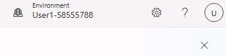

---

#### 03: Configure the **Conversational boosting** topic

1. On the command bar for the agent, select **Topics**.

	

1. On the **Topics** page, select **System**.

	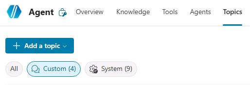

1. Select the **Conversational boosting** topic.

	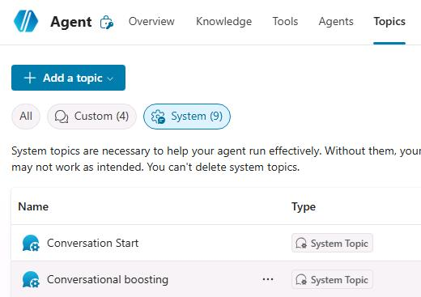

1. Locate the **Create generative answers** node.

	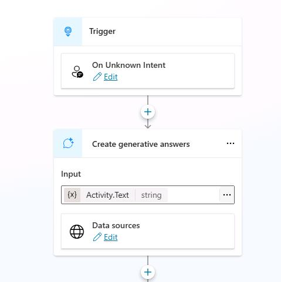

1. At the top right of the node, select the ellipses (**...**), then select **Properties**.

	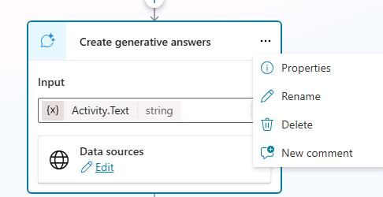

1. In the **Create generative answers properties** pane, locate the **Classic data** section.

1. Ensure that **Allow the AI to use its own general knowledge (preview)** is disabled.

	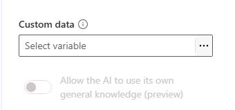

---

#### 04: Add a knowledge source


1. On the command bar for the agent, select **Knowledge**.

	

1. Select **+ Add knowledge**.

	

1. Select **SharePoint**.

	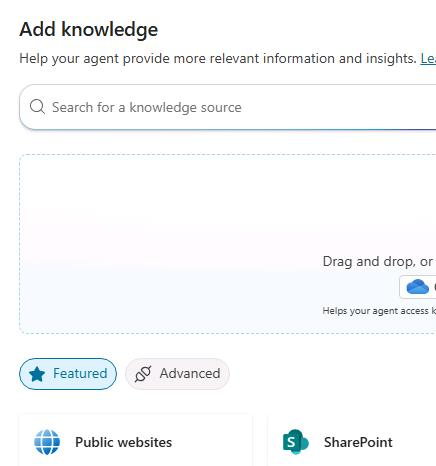

1. In the **SharePoint** dialog, next to **Browse Items**, paste this url: 

    ```
    https://lodsprodmslearnmca.sharepoint.com/sites/Zava-Retail-Data@lab.LabInstance.Id/Shared%20Documents/LabFiles/Zava-Core-Functions/
    ```

	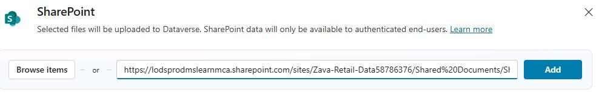

1. Select **Add**.

	

1. Replace the default **Name** field, with the following text `Zava Retail - Business Info - R&D Strategy & Objectives Package`.

1. Replace the default **Description** field, with the following text:

	```
	These files contain Zava Retail Group's core business plan, marketing strategy, cashier details, and R&D materials-including the strategic plan, key objectives, and an executive presentation. Together, these documents outline how Zava will drive innovation, improve efficiency, enhance customer experience, modernize technology, and support long‑term growth.
	```

	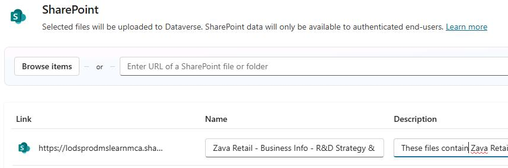

1. Repeat the same steps to add a second knowledge source as a sales‑transaction lookup.

    - Folder Directory: url
        ```
        https://lodsprodmslearnmca.sharepoint.com/sites/Zava-Retail-Data@lab.LabInstance.Id/Shared%20Documents/LabFiles/Zava-Sales-Transaction/
        ```

    - Name: 
        ```
        Zava Order Lookup (Sales Transactions)
        ```

    - Description: 
        ```
        This knowledge source must be used to support all refund, return, replacement, cancellation, and defective‑item workflows. It contains complete Zava sales transaction data-order_id, order_date, product_name, unit_price, order_quantity, loyalty_tier, applied promotions-allowing you to accurately locate and verify any order.
        ```

1. Select **Add to agent**.

	

1. Wait for the agent to confirm the connection to SharePoint and complete the validation process. This process may take several minutes to complete. There is a lot of information that the agent must parse and process.

	{: .note }
    > The **Status** column will initially display **In progress** and will change to **Ready**.
	>
	> 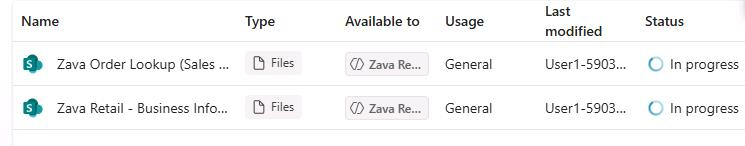
	>
    > Do not continue with the lab until the **Status** column displays **Ready**.
	>
	> 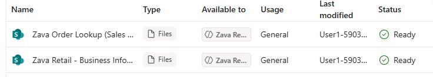

---

#### 05: Test the agent 


1. On the command bar for the agent, select **Test** to display the **Test** pane.

	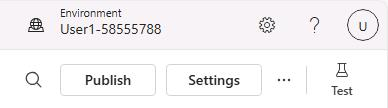

1. In the **Test** pane, select **Start new test session** (the **+** sign).

	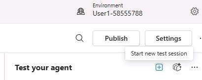

1. Submit the following prompt: 

	```
    What is the refund policy for Zava Retail Group brick‑and‑mortar stores?
    ```

	{: .warning }
    > Since this is the first time that you are connecting to the knowledge source, you may be asked to confirm the connection to SharePoint. In the initial chat response, select **Allow**.
	>
	> 
	>
	> You may need to resubmit the prompt to see a response.

1. Review the response. It should resemble the response in the following screenshot:

	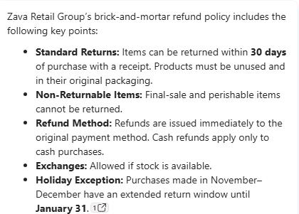

1. Submit the following prompt and review the response:

	```
    Please provide a list of cashiers for the Jersey City store, including the corresponding store addresses and operating hours.
    ```

	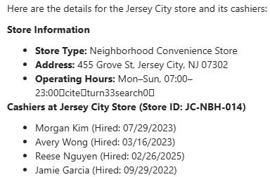

