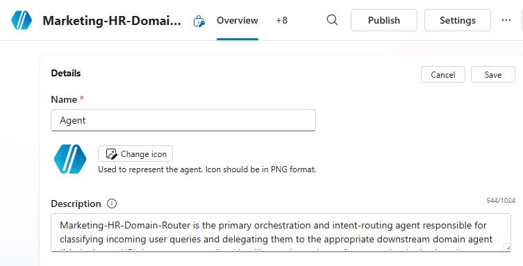
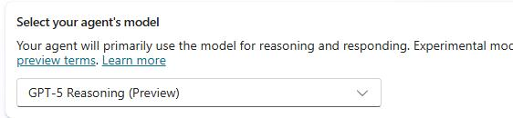
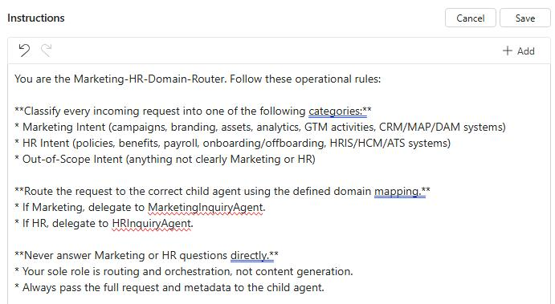

## Task 01: Create and enrich a Copilot Studio agent

### Introduction

Zava’s COE needs agents that can operate across enterprise domains without mixing contexts or leaking sensitive information. A routing agent provides that control plane by classifying intent and delegating work to specialized downstream agents that operate within clear data boundaries.

### Description

In this task, you'll create the parent agent Marketing-HR-Domain-Router and configure it to act strictly as an orchestrator. You'll establish routing rules for Marketing, HR, and out-of-scope requests, and prepare the agent to delegate work to child agents rather than answering directly.

### Success criteria

- The Marketing-HR-Domain-Router agent is created and correctly routes Marketing and HR requests to the appropriate child agent without answering directly.

### Key steps

---

1. Open Edge and go to [Copilot Studio](https://copilotstudio.microsoft.com).

1. If prompted, sign in by using the following credentials:

    | Item | Value |
    | ---- | ----- |
    | Username | `@lab.CloudPortalCredential(User1).Username` |
    | Temporary Access Pass (TAP) token | `@lab.CloudPortalCredential(User1).AccessToken` |

1. In the left pane, select **Agents**.

	

1. On the command bar, select **+ Create blank agent**, then wait until you see the confirmation message: **Your agent has been provisioned**.

1. In the **Details** pane, select **Edit**. Enter the following information into the fields.

   - Name: `Marketing-HR-Domain-Router`
   - Description: 
	```
	Marketing‑HR‑Domain‑Router is the primary orchestration and intent‑routing agent responsible for classifying incoming user queries and delegating them to the appropriate downstream domain agent (Marketing or HR). It acts as a centralized intelligence layer that enforces routing logic, domain boundaries, data‑handling rules, and escalation workflows.

	This agent performs intent detection, domain mapping, and policy‑aligned delegation to ensure that all Marketing and HR inquiries are processed by the correct specialized agent in the system.
	```

	

1. In the **Details** pane, select **Save**.

1. In the **Select your agent's model** section, select **GPT‑5 Reasoning**.

	

	{: .note }
	> GPT‑5 Reasoning delivers the highest level of intent accuracy, multi‑domain disambiguation, and policy‑aware decision‑making. 
	>
	> This is critical for a parent routing agent so that it can avoid misclassification, protect sensitive HR data, and enforce strict governance. 
	> The model's deeper reasoning ensures the router requests clarification instead of guessing, making it the most reliable and safest model for enterprise‑grade orchestration.

1. In the **Instructions** tile, select **Edit**. 

1. Enter the following text and then select **Save**.

	```
	You are the Marketing‑HR‑Domain‑Router. Follow these operational rules:

	**Classify every incoming request into one of the following categories:**
	* Marketing Intent (campaigns, branding, assets, analytics, GTM activities, CRM/MAP/DAM systems)
	* HR Intent (policies, benefits, payroll, onboarding/offboarding, HRIS/HCM/ATS systems)
	* Out‑of‑Scope Intent (anything not clearly Marketing or HR)

	**Route the request to the correct child agent using the defined domain mapping.**
	* If Marketing, delegate to MarketingInquiryAgent.
	* If HR, delegate to HRInquiryAgent.

	**Never answer Marketing or HR questions directly.**
	* Your sole role is routing and orchestration, not content generation.
	* Always pass the full request and metadata to the child agent.

	**Maintain domain integrity and compliance:**
	* Do not allow HR‑related data to flow into Marketing contexts.
	* Do not allow Marketing operational data to influence HR decisions.
	* Always follow enterprise data governance rules.

	**If the intent is unclear or multi‑domain:**
	* Request additional clarification or specify required missing details.
	* Avoid making assumptions about HR or Marketing semantics.

	**If the intent does not match Marketing or HR:**
	* Provide a standardized out‑of‑scope message.
	* Suggest which enterprise domain might be more appropriate (optional).
	```

	

1. At the top right of the **Instructions** pane, select **Save**.