## Task 02: Create a custom OpenAPI connector

### Introduction

Zava’s hybrid environment requires agents to connect to real business systems through governed, reusable connectors. A custom OpenAPI connector demonstrates how Copilot Studio can securely invoke an external service with schema-defined requests and responses.

### Description

In this task, you'll import an OpenAPI definition and create a custom connector that can be used as a tool by an agent. This connector becomes the marketing system integration point that the marketing child agent will call during execution.

### Success criteria

- The **ZavaOpenAPICall** custom connector is created and available as a usable tool in Copilot Studio.

### Key steps

1. Open a new Edge browser tab and go to [OpenAI_smart_connector\publicpage_openapi.json](https://github.com/microsoft/L400-Copilot-and-Agents-at-work/blob/main/OpenAI_smart_connector/publicpage_openapi.json).

	{: .note }
    > This is the configuration file for the connector. 

1. On the command bar for the **publicpage_openapi.json** page, select **Download raw file**.

	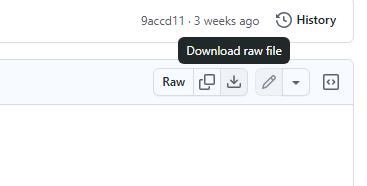

	{: .note }
    > Once the file is downloaded, Edge will present a confirmation dialog.
	>
	> 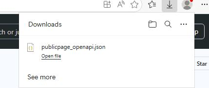

1. Go back to the **Copilot Studio** page, and select the **Marketing-HR-Domain-Router** agent.

1. In the left pane for the agent, select **Tools**.

	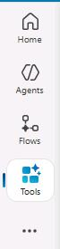

1. Select **+ New tool**.

	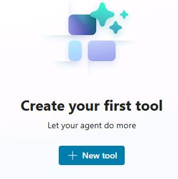

1. In the **New tool** dialog, select **Custom connector**.

	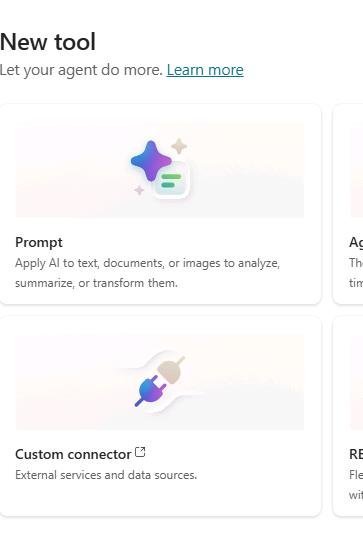

	{: .note }
	> A new browser window opens. You are directed to the Power Apps maker portal. You use the maker portal to create custom connectors. Then, you can access and use the connectors from the Tools page for the agent.

1. If prompted, sign in by using the following credentials:

    | Item | Value |
    | ---- | ----- |
    | Username | `@lab.CloudPortalCredential(User1).Username` |
    | Temporary Access Pass (TAP) token | `@lab.CloudPortalCredential(User1).AccessToken` |

	{: .warning }
    > You are redirected to the Power Apps maker portal **Custom connectors** page.

	

1. On the command bar, select **+ New custom connector**.

	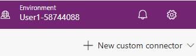

1. Then select **Import an OpenAPI file**.

	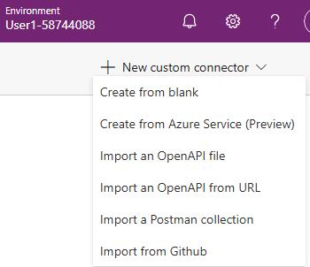

1. In the **Import an OpenAPI file** dialog, in the **Connector name** field, enter `ZavaOpenAPICall`. Then, select **Import**.

	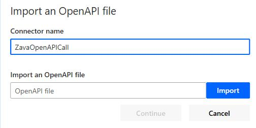

1. In the File **Open** dialog, go to the **Downloads** folder. Select **publicpage_openapi.json** and then select **Open**.

	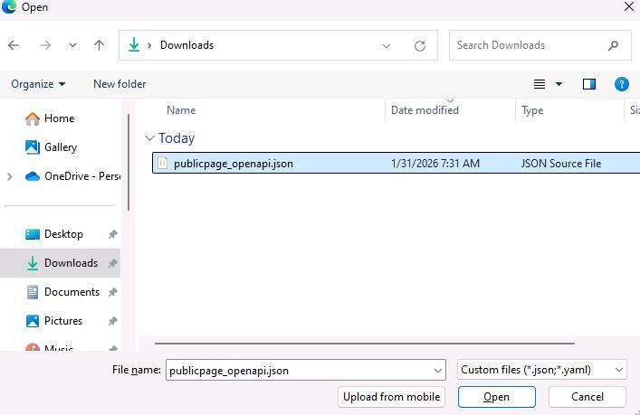

1. In the **Import an OpenAPI file** dialog, select **Continue**.

	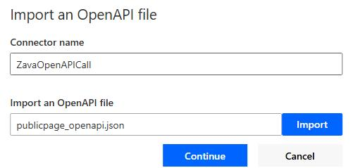

1. On the command bar for the connector, select **Create connector**.

	

1. Wait until the connector configuration process completes.

	{: .note }
    > On the command bar, **Create connector** changes to **Update connector** when configuration is complete.

	
	
1. Select **Close**.

1. Close the Power Apps page and return to the **Copilot Studio** page.

1. Refresh the **Tools** page. the **ZavaOpenAPICall** tool will display.

	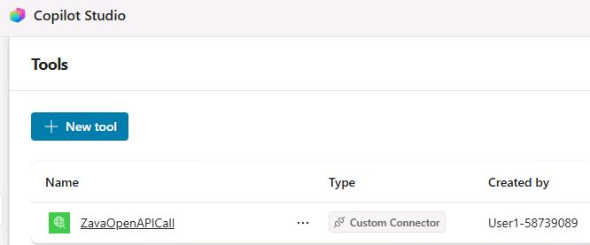