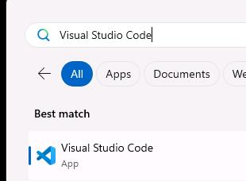
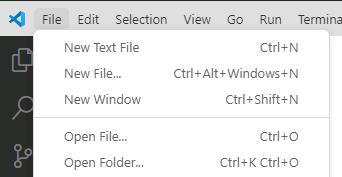
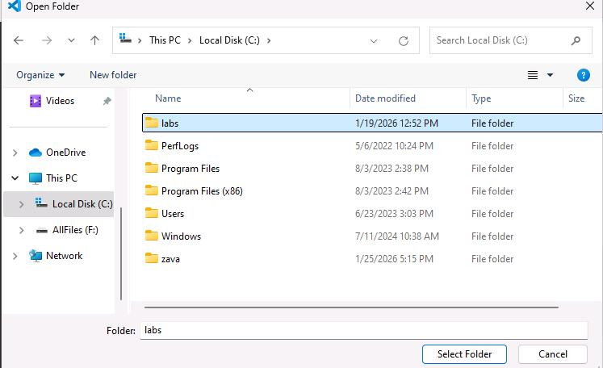
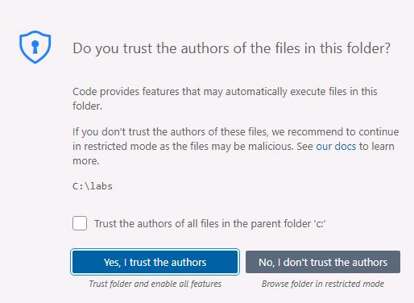
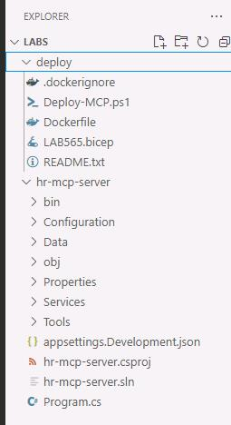
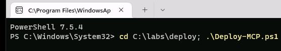
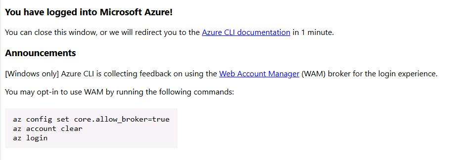
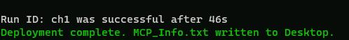
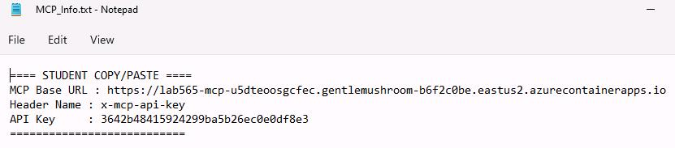

## Task 03: Deploy an MCP Server

### Introduction

Many enterprise scenarios require controlled access to specialized datasets that should not be broadly exposed through general knowledge sources. MCP provides a structured way to expose tools and data to agents with explicit boundaries and authentication.

### Description

In this task, you'll deploy and configure an HR MCP server and capture the connection details needed to add it as a tool in Copilot Studio. This sets up secure, tool-based access to HR directory data for the HR child agent.

### Success criteria

The MCP server deployment completes successfully and MCP_Info.txt provides a working base URL and API key for Copilot Studio connection.

### Key tasks

---

#### 01: Explore the MCP server components (optional)

1. Search for and open `Visual Studio Code` to launch the app.

	

1. On the menu bar, select **File** and then select **Open Folder**.

	
	
1. Go to and select `C:\labs` and then select **Select Folder**.

	

1. In the dialog that displays, select **Yes, I trust the authors**.

	

1. Expand the **hr-mcp-server** folder.

	

1. Explore the files in the following folder:

	- **Data:** hr-mcp-server\Data\candidates.json
	- **Services:** hr-mcp-server\Services
	- **Tools:** hr-mcp-server\Tools

	{: .note }
    > Select any file to view the file contents.

1. Close **Visual Studio Code**.


---

#### 02: Deploy and configure the MCP server

1. In the @lab.VirtualMachine(Win11).SelectLink virtual machine, on the Windows task bar, right-click **Windows PowerShell**, and select **Run as administrator**.

	

1. At the PowerShell prompt, enter the following command:
 
    ```PowerShell
    cd C:\labs\deploy; .\Deploy-MCP.ps1
    ```

	

1. When prompted, sign in by using the following credentials:
 
    | Object | Value |
    | -------- | -------- |
    | Username | +++@lab.CloudPortalCredential(User1).Username+++ |
    | Tap | +++@lab.CloudPortalCredential(User1).AccessToken+++ |
 
1. Close the confirmation web page and return to PowerShell.

	

1. Leave **PowerShell** window up and running and go back to **Copilot Studio**. You'll connect to the MCP server later in the lab.

	{: .warning }
    > It may take up to 10 minutes for the system to deploy the MCP server. You can leave the process running and continue on to the next task. Check back later to ensure that the process has completed.
	
	{: .note }
	> When the process is complete, the following actions will occur:
	> - The PowerShell window will display the message **Deployment complete. MCP_Info.txt written to Desktop**.
	
	>
	> - A file named **MCP_Info.txt** is added to the desktop. This file contains the information that you'll need to connect to the MCP server.

1. Double-click **MCP_Info.txt**.

1. Review the file contents. The file contents should resemble the following screenshot:

	
