## Task 03: Create a child agent to handle marketing inquiries

### Introduction

Zava needs domain-specific agents that can act on enterprise tools while staying within clear scope. The marketing agent must use approved connectors for marketing actions and avoid answering outside its domain.

### Description

In this task, you'll create **MarketingInquiryAgent** as a child agent and attach the OpenAPI connector as its required tool. You'll configure the agent instructions so it answers marketing requests only through the tool and declines non-marketing intents.

### Success criteria

- **MarketingInquiryAgent** successfully handles a marketing prompt by calling the marketing tool and returning a grounded response.

### Key steps

---

#### 01: Create the child agent

1. Return to the **Copilot Studio** page.

1. Select **Agents** and then select **Marketing-HR-Domain-Router**.

	

1. On the command bar, select **Agents** and then select **+ Add**.

	

1. Select **New child agent**.

	

1. Add the following information:
	- **Agent Name:** `MarketingInquiryAgent`
    - **When will this be used?:** `The agent chooses - Based on description`
	- **Agent Description:** 
        ```
        This agent processes all marketing‑related inquiries, including campaigns, branding, digital assets, analytics, and interactions with systems such as CRM, MAP, and DAM, while upholding established marketing standards and escalating any out‑of‑scope or non‑marketing intents to the parent orchestrator for proper handling. It can also invoke a custom API to retrieve or update campaign data, access approved brand assets, trigger marketing workflows, or perform other system‑level operations, using secure authentication, schema‑validated payloads, and audited request and response logging.
        ```

1. On the command bar for the agent, select **Save**.

	{: .warning }
	> If Copilot Studio displays a message stating that there is an error, wait a few seconds and then try saving again. Copilot Studio might still be in the process of validating your instructions.

1. In the left pane for **MarketingInquiryAgent**, select **Tools**, and then **Add tool**.

	{: .warning }
	> Be sure to select **Tools** in the left pane for the child agent and not the left pane in Copilot Studio.

	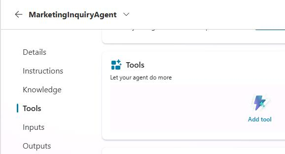

1. Search for and select `ZavaOpenAPICall` then press enter.

	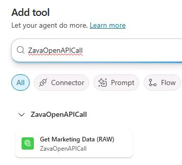

1. Select the newly created tool, **ZavaOpenAPICall**.

	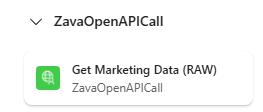

1. Next to **Connection**, select the dropdown, and then select **Create new connection**.

	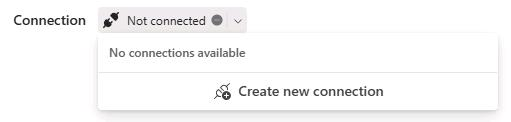

1. Select **Create**.

	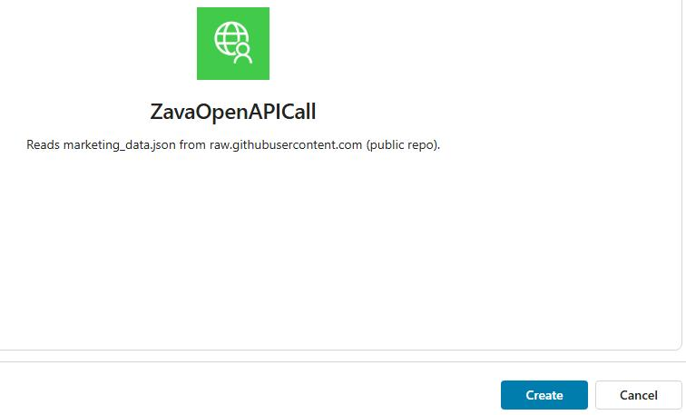

1. Select **Add and configure**.

	

1. On the command bar, select **Settings** and then select **Connection Settings**.

	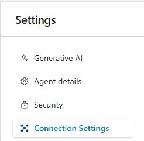

1. Select **Connect** and then select **Submit**. 

	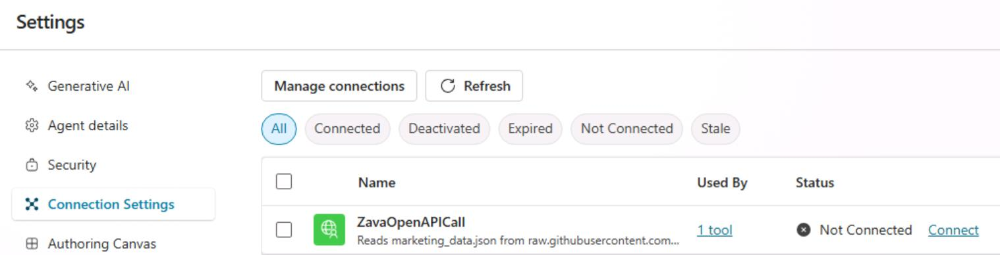

1. Wait until the **status** is **Connected** and then exit **Settings**. 

1. On the **Marketing-HR-Domain-Router** page, select **Agents**.

	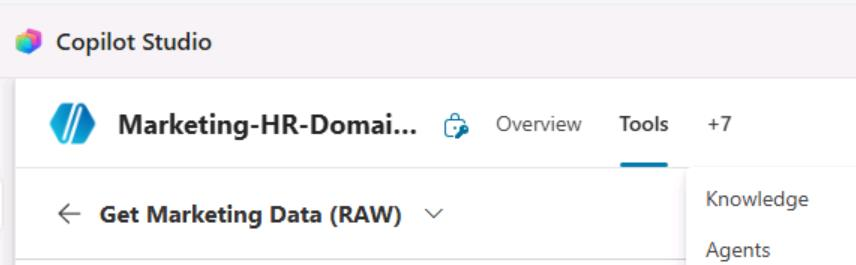

1. Select the **MarketingInquiryAgent** child agent.

1. Select **Instructions** and enter the following text:

	```
    For any inquiry related to marketing, respond only by using [tool]. For all non‑marketing inquiries, decline and direct the user to their primary assistant. Do not answer marketing questions without calling MarketingInquiryAgent.
    ```

1. Highlight and delete **[tool]** and enter **/**. In the context menu, in the **Tool** section, select **Get Marketing Data (Raw)**.

	

1. On the command bar, select **Save**.

	

1. Start a new test session and submit the following prompt: 

	```
    Please explain why the marketing team wants to open a couple of new stores?
    ```

	{: .note }
    > It may take a moment to respond because it needs to access external resources, and the GPT model is performing deep reasoning. Once it completes, notice how **Marketing‑HR‑Domain‑Router** was able to route the request to **MarketingInquiryAgent**, its child agent.

	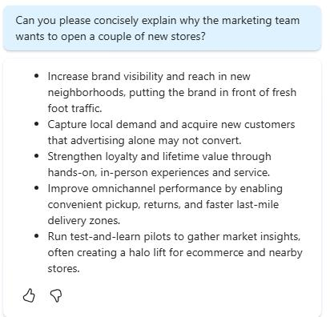


---

#### 02: Revise the parent agent's instructions to reinforce its redirect‑thinking process.

1. Select the **Overview** tab of the **Marketing‑HR‑Domain‑Router** agent.

	

1. [] In the **Instructions** tile, select **Edit**.

1. [] Locate the text `If Marketing, delegate to MarketingInquiryAgent.` 

1. [] Highlight and delete **MarketingInquiryAgent** and then enter `/`. Select the **MarketingInquiryAgent** agent from the list.

	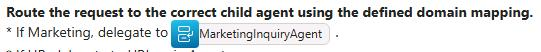

1. []On the **Instructions** tile, select **Save**.

1. [] On the command bar, select **Publish**.

	

1. [] In the confirmation dialog, select **Publish**.

	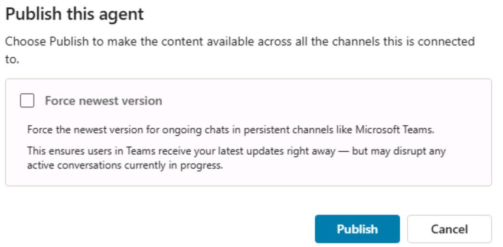

---

# Congratulations! 
You have completed this portion of the workshop. 

### !If you're following these istructions as part of the live lab, you will launch a separate environment to complete Exercises 03 and 04 of the workshop.
