## Task 05: Create a child agent to handle HR inquiries 

### Introduction

HR data is sensitive and must be accessed through tightly controlled interfaces. Zava’s governance expectations require HR questions to be answered through authenticated tools, with clear separation from other business domains.

### Description

In this task, you'll create **HRInquiryAgent** as a child agent and connect it to the deployed MCP server using the provided base URL and API key. You'll then update the parent routing agent so HR requests are delegated to HRInquiryAgent and tested end to end.

### Success criteria (single-line, result-only)

- **HRInquiryAgent** connects to the HR MCP server and returns correct HR directory results when routed a sample HR prompt by the parent agent.

### Key steps

---

#### 01: Create the agent

1. On the command bar of the **Marketing‑HR‑Domain‑Router** agent, select **Agents**.

	

1. Select **Add an agent**.

	

1. Select **New child agent**.

	

1. Provide the following details:
	- **Agent Name:** `HRInquiryAgent`
    - **When will this be used?:** `The agent chooses - Based on description`
	- **Agent Description:** 

	```
	HRInquiryAgent is an internal HR directory assistant that helps employees quickly find HR team members by skill, role, language, or name. It provides clear, concise answers based on the available HR staff data, helping users identify the right HR contact for recruitment, onboarding, performance management, training, employee relations, and other HR needs.
	```

1. Add the following text to the **Instructions** section.

	```
	You are an HR‑specialized child agent.
	Any inquiry involving HR topics - including but not limited to hiring, recruiting, employee data, skills, languages, onboarding, offboarding, compensation, benefits, training, employee relations, conflict resolution, performance management, workforce planning, HR analytics, or any request referencing HR personnel (such as John Doe, Jane Smith, Alice Johnson, Bob Brown, Emily Davis) - must be handled exclusively by calling the  HRMCPServer Tool.
	You must NOT answer HR questions directly. You must NOT generate your own HR content.
	If the user asks anything outside HR, politely decline and tell them to ask the primary assistant.
	When uncertain, assume the request is HR‑related and use the HRMCPServer Tool.
	```

1. Select **Save**.


1. On the command bar for the child agent, select **Tools**.

	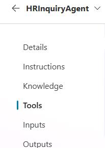

1. Select **+ Add a tool**. 

	

1. Select **Model Context Protocol**.

	

1. Provide the following details under **Model Context Protocol**:
	- **Server Name:** `HRMCPServer`
    
    - **Server description:** 
        ```
        This file contains a structured list of HR professionals, each with their name, contact information, spoken languages, key skills, and current HR role.
        ```

	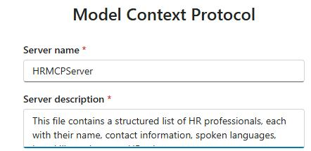

1. Go to the virtual machine desktop, locate the **MCP_Info.txt** file, and open it.

	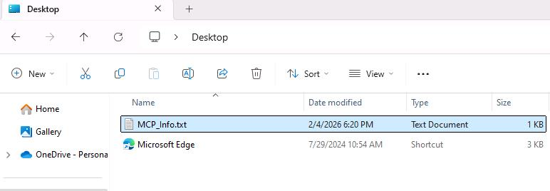

1. Copy the **MCP Base URL** value from the **MCP_Info.txt** file you just opened.

	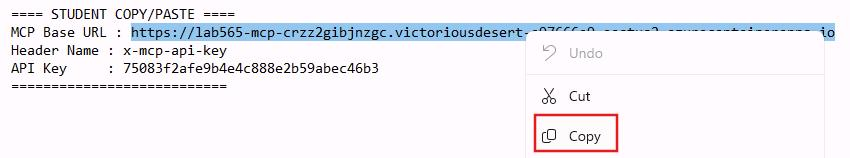

1. Go back to **Copilot Studio** and paste the URL into the **Server URL** field. 

	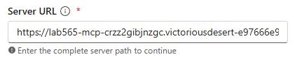

1. In the **Authentication** section, select **API Key**.

1. In the **MCP_Info.txt** file, copy the **Header Name** value.

	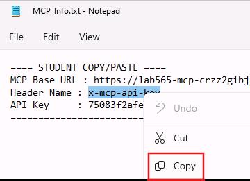

1. Go back to **Copilot Studio** and paste this value into the **Header Name** field.

	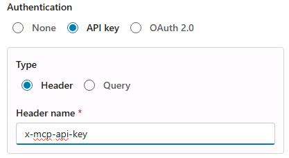

1. Select **Create**. Wait for the confirmation message to appear.

	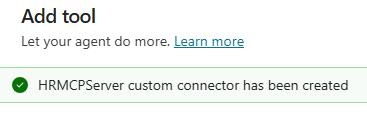

1. Open the dropdown next to **Not connected** and then select **Create new connection**.

	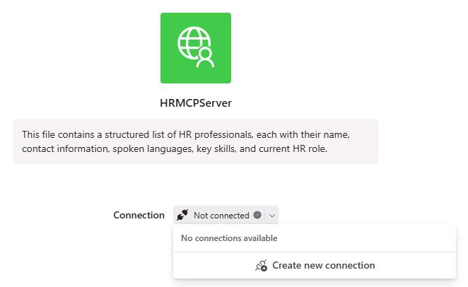


1. In the **MCP_Info.txt** file, copy the value of the **API Key**. 

	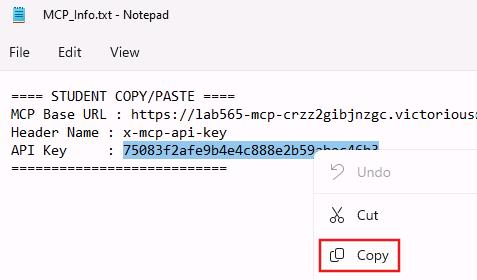

1. Return to **Copilot Studio** and paste in the key.

	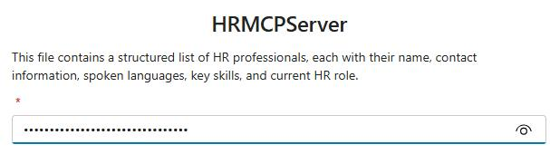

1. Select **Create**.

	

1. Wait for the green checkmark to display next to your MCP Server name. This means you're all set. 

1. Select **Add and configure** then wait until the process completes.

	

1. Upon completion, the MCP Server is added as a tool to your child agent.
	
	

1. To ensure our connection is ready, select **settings** and then go to **Connection Settings**.

1. Select **Connect** and then select **Submit**.

1. Wait until the **Status** is **Connected** and then exit **Settings**. 

	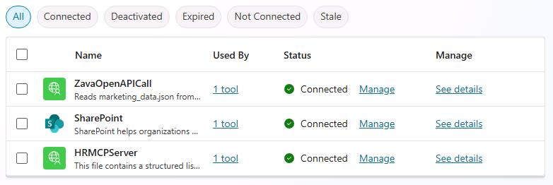

---

#### 02: Update the parent agent instructions

1. On the command bar for **Marketing-HR-Domain-Router**, select **Overview**.

	

1. In the **Instructions** tile, select **Edit**. Search for and select **If Marketing, delegate to HRInquiryAgent.** 

1. Highlight **HRInquiryAgent**, press Delete, then type **/**. Select the **HRInquiryAgent** agent from the list.

	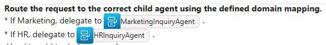

1. Select **Save** and then select **Publish**.

1. Start a new test session and submit the following prompts. Review the responses.

	- MCP HR Test prompt 1: 
    
        ```
        Who should I contact for employee relations?
        ```

	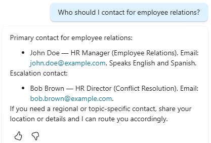
	
    - MCP HR Test prompt 2: 
        ```
        Who can assist me with the onboarding and training process and also speak French?
        ```

	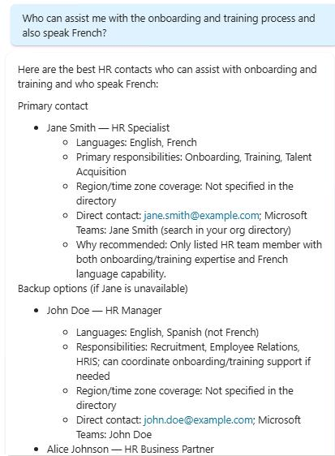
	
    - Marketing Test prompt 1: 
        ```
        Which category generated the highest revenue in Nov-Dec 2025, and what percentage of total net revenue did it represent? Also compare its average ticket to the overall AOV.
        ```
	
    - Marketing Test prompt 2: 
        ```
        Which promotion was most efficient (lowest discount‑to‑revenue ratio), and what was its average discount per order and share of total orders?
        ```

	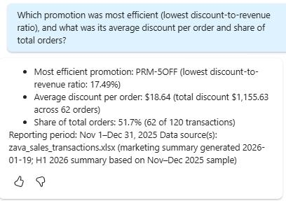
