## Task 01: Deploy an MCP Server 

In this task, you will deploy an MCP server. Later in the workshop, you will connect an agent to the MCP server.

### Key tasks

---

#### 01: Explore the MCP server components (optional)

<!-- 1. [] In the @lab.VirtualMachine(Win11).SelectLink virtual machine, on the Windows task bar, select **Start** (windows logo).

	

1. [] Search for and select `Visual Studio Code` to launch the app.

	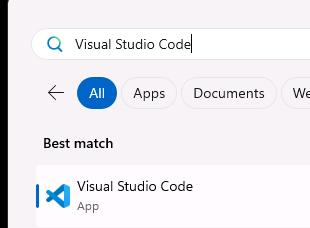 -->

1. [] On the VM's taskbar, open Visual Studio Code.

	

1. [] On the menu bar, select **File** and then select **Open Folder**.

	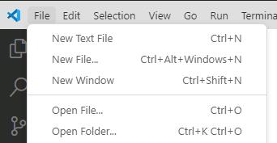
	
1. [] Go to `C:\`, select **labs**, then select **Select Folder**.

	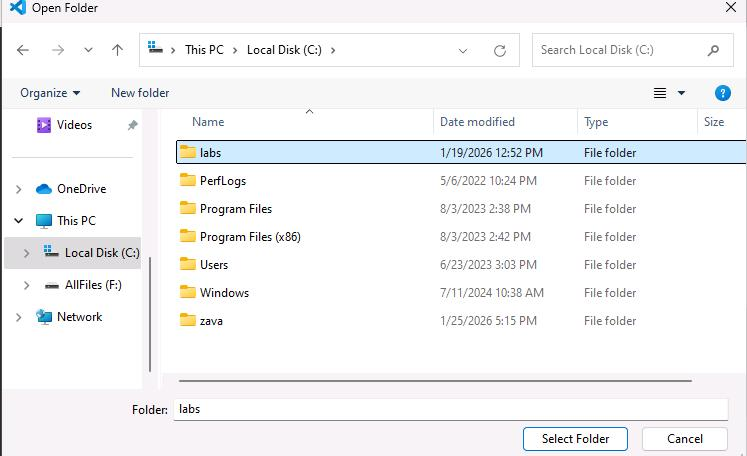

1. [] In the dialog that displays, select **Yes, I trust the authors**.

	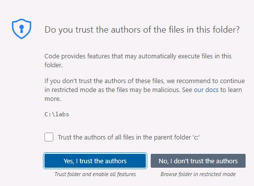

1. [] Expand the **hr-mcp-server** folder.

	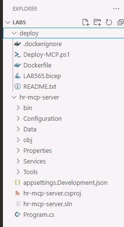

1. [] Explore the files in the following folder:

	- **Data:** hr-mcp-server\Data\candidates.json
	- **Services:** hr-mcp-server\Services
	- **Tools:** hr-mcp-server\Tools

	{: .note }
	> Select any file to view the file contents.

1. [] Close **Visual Studio Code**.


---

#### 02: Deploy and configure the MCP server

1. [] In the @lab.VirtualMachine(Win11).SelectLink virtual machine, on the Windows taskbar, right-click **Windows PowerShell** and select **Run as administrator**.

	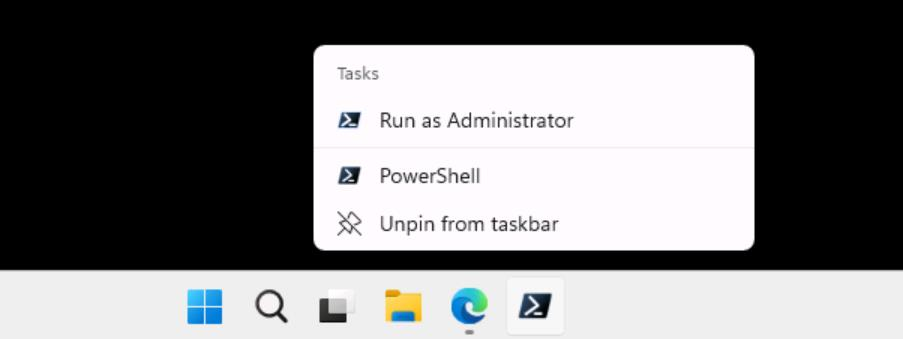

1. [] At the PowerShell prompt, enter the following command:
 
    ```
	cd C:\labs\deploy
	```

1. [] At the PowerShell prompt, enter the following command:

	```
	pwsh -File C:\labs\deploy\Deploy-MCP.ps1
	```

	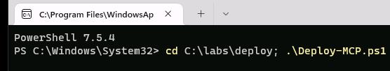

1. [] When prompted, sign in by using the following credentials:
 
    | Object | Value |
    | -------- | -------- |
    | Username | +++@lab.CloudPortalCredential(User1).Username+++ |
    | Tap | +++@lab.CloudPortalCredential(User1).AccessToken+++ |
 
1. [] Close the confirmation web page and return to PowerShell.

	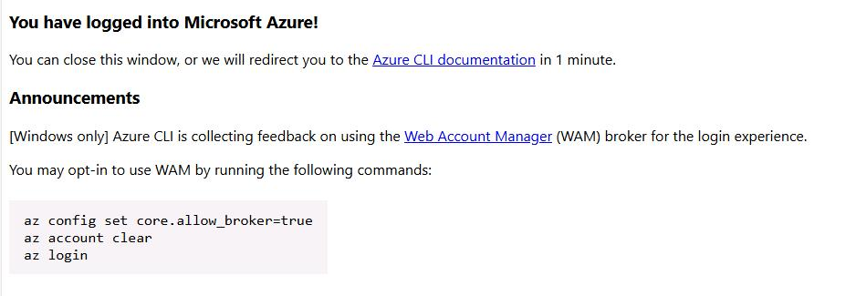

	{: .note }
	> After a couple of minutes, you will start to see activity in the PowerShell window.
	>
	> 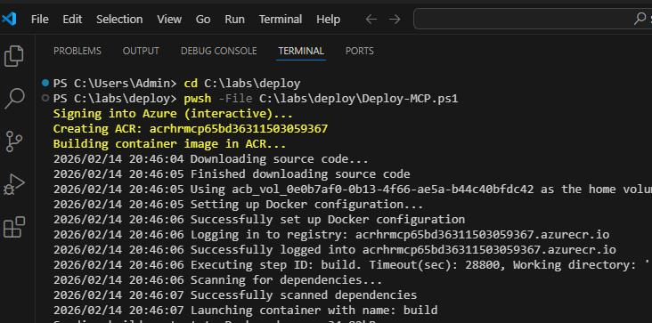

1. [] Leave the **PowerShell** window open.

	{: .warning }
	> It may take up to 10 minutes for the system to deploy the MCP server. 
	>
	> You can safely continue with other tasks in this exercise while you wait for the MCP server to get ready. Check back later to ensure that the process has completed.
	
	{: .note }
	> When the process is complete, the following actions will occur:
	> - The PowerShell window will display the message **Deployment complete. MCP_Info.txt written to Desktop**.
	> 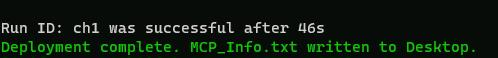
	>
	> - A file named **MCP_Info.txt** is added to the desktop. This file contains the information that you will need to connect to the MCP server.

1. [] Double-click **MCP_Info.txt**.

1. [] Review the file contents. The file contents should resemble the following screenshot:

	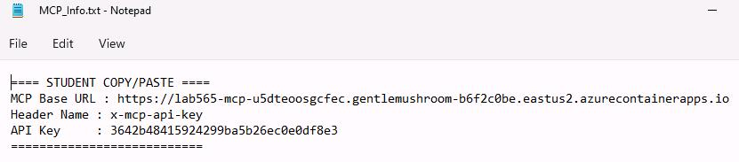
