## Task 01: Create an agent by using Microsoft Foundry

### Introduction

As Zava’s COE moves toward advanced agentic workflows, they need a safe way to introduce deeper reasoning and richer analysis without letting Copilot Studio improvise outside enterprise boundaries. A Foundry agent provides a controlled “specialist” that can be grounded in a specific dataset and invoked only when required.

### Description

In this task, you'll create a Foundry agent that uses a provided internal dataset for store banking reconciliation scenarios. You'll deploy the model, attach the dataset as a vector index, validate the agent’s behavior with test prompts, and capture the project endpoint needed for integration with Copilot Studio.

### Success criteria

- A Foundry agent is created with the attached dataset and produces grounded answers to a test prompt, and the project endpoint is captured for integration.

### Key steps

---

#### 01: Prepare Microsoft Foundry

1. Open Edge and go to [Microsoft Foundry](https://ai.azure.com/).

1. Sign in by using the following credentials:
 
    | Object | Value |
    | -------- | -------- |
    | Username | **@lab.CloudPortalCredential(User1).Username** |
    | Tap | **@lab.CloudPortalCredential(User1).AccessToken** |

1. At the top of the Foundry home page, set **New Foundry** to **On**.

	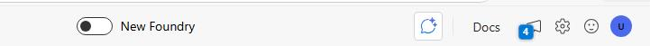


1. In the **Select a project to continue** dialog, **Create a new project**.

	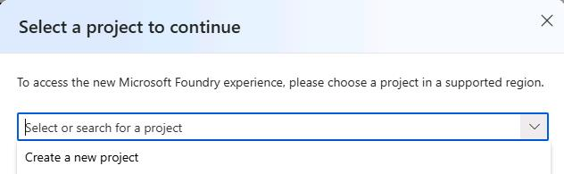

1. In the **Project** field, enter `Zava-Retail-Data@lab.LabInstance.Id` and then select **Create**.

	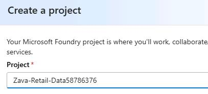

	{: .note }
    > It may take up to 5 minutes to create the agent.

1. On the command bar, select **Build**. 

	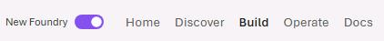

    {: .note}
    > You'll configure permissions in the next task.

---

#### 02: Configure Microsoft Foundry

In this section you will give the user account permissions for uploading files in Foundry.

1. In a new tab, go to the [Azure portal](portal.azure.com).

1. If prompted, sign in by using the following credentials:
 
    | Object | Value |
    | -------- | -------- |
    | Username | **@lab.CloudPortalCredential(User1).Username** |
    | Tap | **@lab.CloudPortalCredential(User1).AccessToken** |

1. In the **Search** field, enter `Microsoft Foundry`.

1. In the list of search results, select **Microsoft Foundry**.

	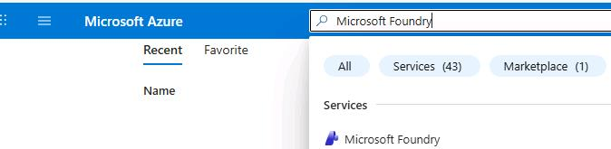

1. On the Microsoft Foundry page, in the left pane, select **All resources**.

	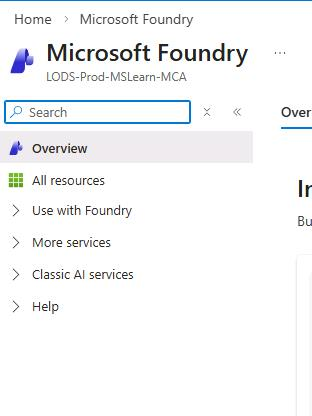

1. Select **zava-retail-data@lab.LabInstance.Id-resource**.

1. On the page for the resource, in the left pane, select **Access control (IAM)**.

	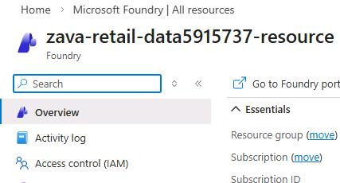

1. In the **Grant access to this resource** tile, select **Add role assignment**.

	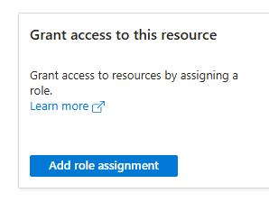

1. Search for and select the `Azure AI developer` role and then select **Next**.

	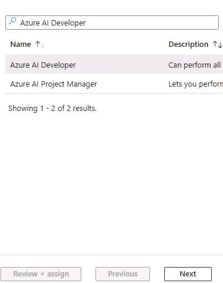

1. Select **+ Select members**.

	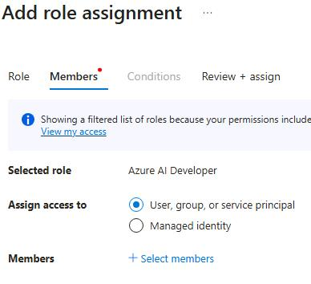

1. Search for and select `@lab.CloudPortalCredential(User1).Username`.

	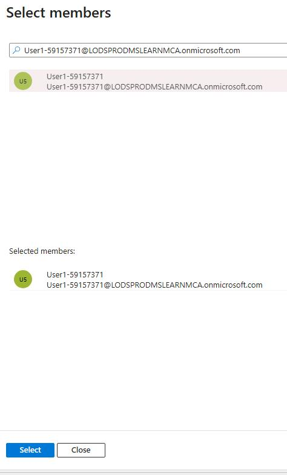

1. Select **Review + assign** twice.

	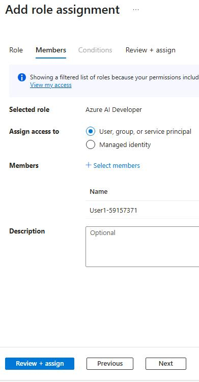

---
#### 03: Configure and deploy the agent

1. Return to the Foundry tab in Edge, and then select **Models** and then select **Deploy a base model**.

	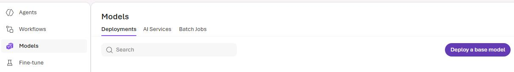

1. Search for and select `gpt-5.2-chat`.

1. Select **Deploy** and then select **Default settings**.

	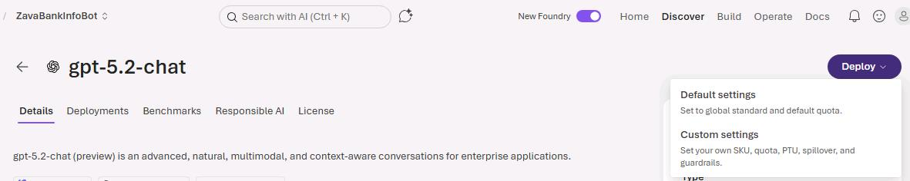

1. In the **Instructions** field, enter the following text:
	
	```
	Use only the provided internal synthetic dataset to retrieve, analyze, and reconcile store‑level banking information. Always reference exact values for each store's balances, pending amounts, metadata, risk flags, snapshots, limits, and settlement times. Apply the global reconciliation rules strictly, including PendingThresholdHigh (12,000), AvailableMinBuffer (5,000), discrepancy tolerance (2 cents), and local‑currency evaluation. 

	Do not infer missing data or use external sources. Convert currencies only when explicitly requested using the supplied FX rates. Identify threshold breaches, trend anomalies, and risk‑flag conditions exactly as defined. All outputs must be factual, deterministic, and grounded solely in the dataset.
	```

	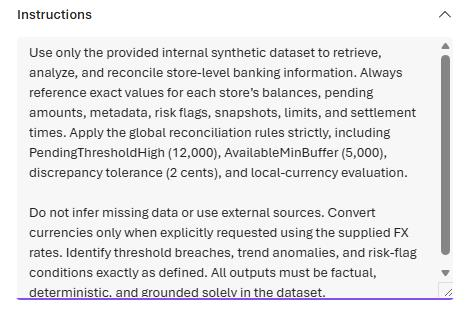

1. In the **Tools** section, select **Upload files**.

	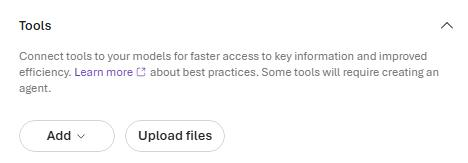

	{: .warning }
    > If the button is not enabled, wait 30 seconds and refresh the page. It can take some time for the permission you created in the earlier section to propagate.
	
	

1. Select **browse for files**, go to 

    ```
    C:\zava\Banking-info\dummy_banking_details.txt
    ``` 
    
    And then select **Open**.

	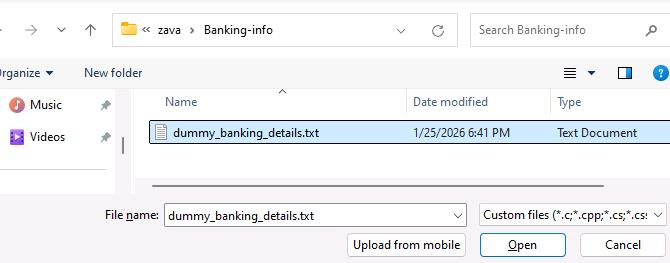

1. Set **Vector index name** to `Zava-Bank-Privacy-Details`.

	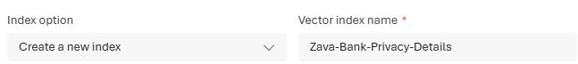

1. Select **Attach**.

	

1. On the command bar, select **Save as agent**.

	

1. In the **Create an agent** dialog, in the **Agent name** field, enter  `zava-store-private-bank-detail-bot` and then select **Create**.

	

    {: .warning }
    > If it doesn't take you to the agent page, refresh the page.

1. Submit the following prompt:

	```
    What is the pending amount for BOS‑POP‑009, and does it exceed the global PendingThresholdHigh?
    ```

1. On the command bar, select the avatar icon and then select **Project details**.

	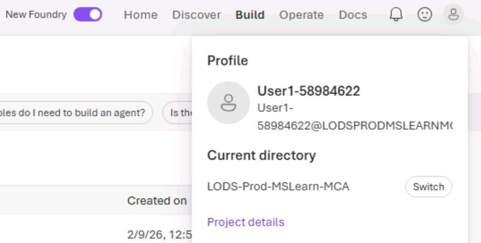

1. Copy the **Endpoint** value.

	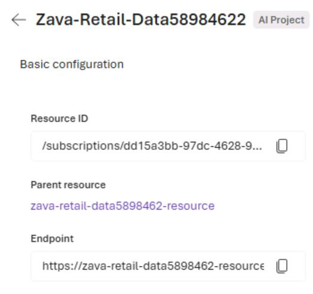

1. Paste the value into a notepad file. You will need the value for the following task.

	@lab.TextBox(FoundryProjectEndpoint)