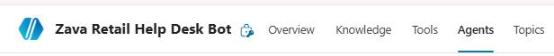
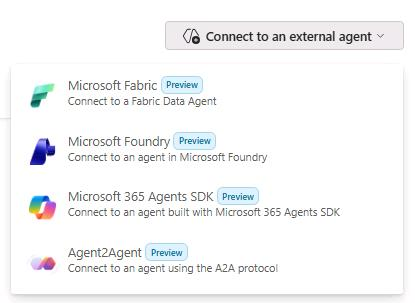
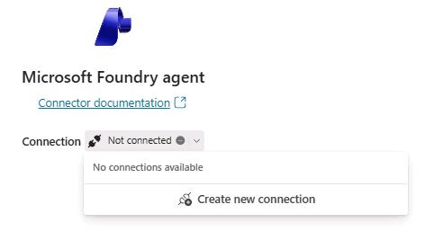
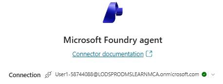
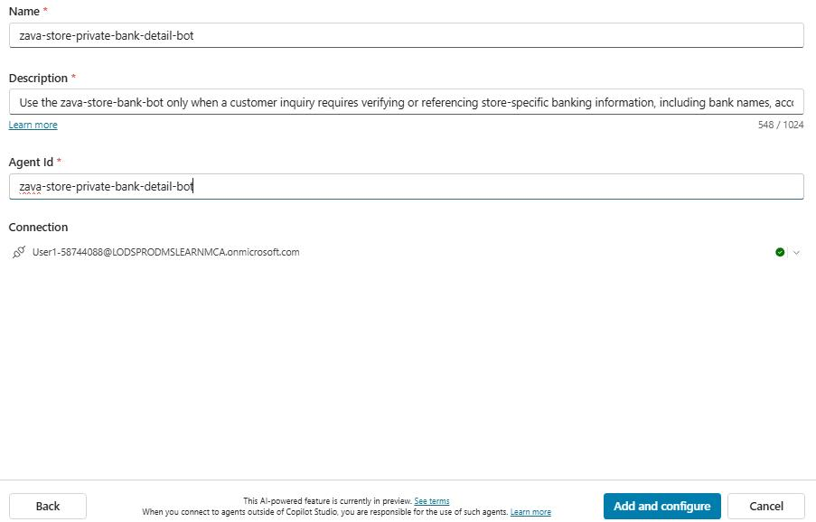

## Task 03: Connect the agent to the "Zava Retail Help Desk Bot" in Copilot Studio

### Introduction

Zava’s hybrid operating model requires specialized capabilities to plug into existing Copilot Studio experiences without breaking user workflows or governance controls. Connecting Foundry as an external agent demonstrates how Zava can extend Copilot Studio with deeper reasoning while keeping orchestration centralized.

### Description

In this task, you'll add the Foundry agent as a connected external agent to the Zava Retail Help Desk Bot. You'll configure the connection using the Azure AI Project Endpoint, provide the agent identity details, and ensure the integration is available for orchestration and testing.

### Success criteria

- The Foundry agent is successfully connected in Copilot Studio and is available as a callable external agent from the Zava Retail Help Desk Bot.

### Key steps

---

#### 01: Add zava-store-private-bank-detail-bot as a connected agent to copilot studio

1. Open Edge and go to [Copilot Studio](https://copilotstudio.microsoft.com/).

1. If prompted, sign in by using the following credentials:
 
    | Object | Value |
    | -------- | -------- |
    | Username | **@lab.CloudPortalCredential(User1).Username** |
    | Tap | **@lab.CloudPortalCredential(User1).AccessToken** |

1. In the leftmost pane, select **Agents**.

1. Select **Zava Retail Help Desk Bot**.

1. On the command bar, select **Agents** and then select **+ Add**.

	

1. Locate **Connect to an external agent**, open the dropdown menu, and select **Microsoft Foundry**.

	

1. Select connection and then select **Create new connection**.

	

1. In the **Azure AI Project Endpoint** field, enter the following value:

	```
    <FoundryProjectEndpoint>
    ```

1. Select **Create**.

	

1. When prompted, sign in by using the following credentials:
 
    | Object | Value |
    | -------- | -------- |
    | Username | **@lab.CloudPortalCredential(User1).Username** |
    | Tap | **@lab.CloudPortalCredential(User1).AccessToken** |

	

1. Select **Next**.

	

1. In the **Connect Microsoft Foundry agent** dialog, enter the following information:
   
   - **Name:** `zava-store-private-bank-detail-bot`
   - **Description:**

	```
	Use the zava‑store‑bank‑bot only when a customer inquiry requires verifying or referencing store‑specific banking information, including bank names, account types, routing numbers, pending transactions, or available balances linked to a specific Store ID. 
	
	Provide very concise details exactly as listed in the agent's knowledge source, without inferring, altering, or expanding any financial data. This agent is intended strictly for internal validation and store‑related financial inquiries and must never be used for customer‑facing disclosures.
	```
   - **Agent Id:** `zava-store-private-bank-detail-bot`

1. Select **Add and configure** and wait for the process to complete.

	