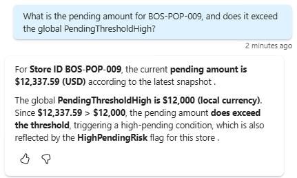
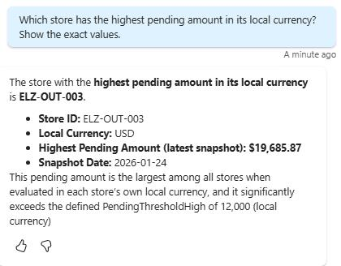

## Task 03: Test the Foundry agent connected functionalities from Copilot Studio

### Introduction

Zava’s CIO expects proof that advanced agents behave predictably in real workflows, including correct delegation and accurate retrieval. Testing confirms the help desk bot triggers the connected agent when appropriate and returns results that stay grounded in approved data.

### Description

In this task, you'll run prompts in Copilot Studio that require store banking detail verification and observe the bot delegating to the connected Foundry agent. You'll validate that the response matches the data-backed behavior seen in Foundry and aligns with the configured reconciliation rules.

### Success criteria

- Copilot Studio successfully invokes the connected Foundry agent and returns correct, grounded results for the provided test prompts.

### Key steps

---

1. Submit the following prompt and review the response:

	 `What is the pending amount for BOS‑POP‑009, and does it exceed the global PendingThresholdHigh?`

	

	{: .note }
    > Observe how the agent successfully called the connected Microsoft Foundry agent and produced a similar response when the same prompt was tested directly in Foundry.
You may validate the agent's response by reviewing the file located at `C:\zava\Banking-info`

1. Submit the following prompt and review the response:

	```
    Which store has the highest pending amount in its local currency? Show the exact values.
    ```

	
