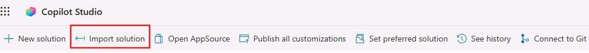
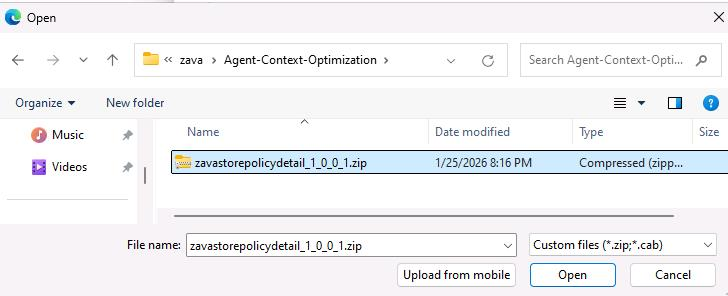
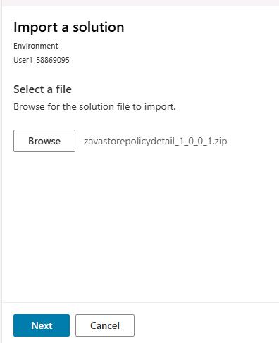
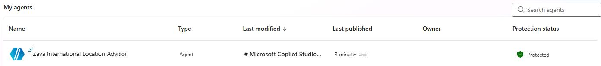
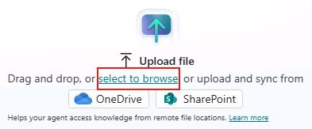
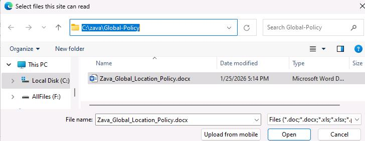
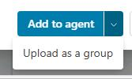
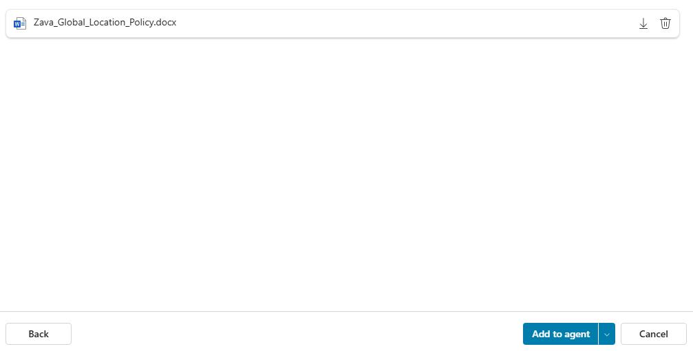

## Task 01: Prepare the environment for evaluating an agent

### Introduction

Zava’s CIO requires evidence-based readiness before any agent moves beyond pilot, and that starts with making evaluations repeatable and reliable. Before you can measure groundedness, tool usage, and safety behavior, the agent and its knowledge sources must be correctly imported and functioning in a controlled environment.

### Description

In this task, you'll import the Zava International Location Advisor solution and configure it so it can be evaluated consistently. You'll add the required knowledge source and confirm the agent is ready for testing and evaluation workflows inside Copilot Studio.

### Success criteria

- The Zava International Location Advisor is imported and fully configured with required knowledge so it’s ready to be evaluated.

### Key steps

---

1. Open Edge and go to [Copilot Studio](https://copilotstudio.microsoft.com) .

1. If prompted, sign in by using the following credentials:

    | Item | Value |
    | ---- | ----- |
    | Username | `@lab.CloudPortalCredential(User1).Username` |
    | Temporary Access Pass (TAP) token | `@lab.CloudPortalCredential(User1).AccessToken` |

1. In the left pane, select **Agents**.

	

1. On the command bar, select **Import agent**.

1. Select **Import solution**.

	

1. Select **Browse**, go to `C:\zava\Agent-Context-Optimization`, and select **zavaretailstore_1_0_0_1.zip**. Then, select **Open**.

	

1. Select **Next** and then select **Import**.

	

	{: .warning }
    > It may take 3-5 minutes to import the solution.
	> When the import is complete, a confirmation message will display.
	>
    > 

1. Go back to **Copilot Studio** and refresh your browser. **Zava International Location Advisor** should display.

	

1. Select **Zava International Location Advisor** and then select **Knowledge**.

	

1. Select **Add knowledge**.

	

1. Select **Select to browse**.

	

1. Go to `C:\zava\Global-Policy` and select **Zava_Global_Location_Policy.docx**. Then, select **Open**.

	

	{: .note }
    > The **Add to agent** presents options. 
	>
	>
	>
	> When adding knowledge to Copilot Studio, it is important to choose the option that best matches how your files relate to each other:
	>  - **Add to agent** - Use this when files are distinct and unrelated. Each file is added as its own separate knowledge source, and Copilot treats them independently.
	>
	>  - **Upload as a group** - Use this when your files are related or part of the same topic. Copilot stores them as one grouped knowledge source, allowing it to read them in shared context and produce more consistent, accurate answers.

1. Select **Add to agent**. It will take 3-5 minutes for the process to complete. You can safely proceed to the next task while the process completes. 

	
