## Task 02: Run evaluations

### Introduction

Zava needs a standardized way to verify that agents respond correctly, stay grounded, and behave safely under real user prompts. Running evaluations helps the COE quickly identify failures like hallucinations, weak grounding, or incorrect tool behavior before stakeholders see them.

### Description

In this task, you'll create and run an evaluation test set using generated and manually authored questions. You'll configure test methods (quality, similarity, text match), map tool connections, run the evaluation, and review results—including activity maps—to understand how the agent produced its answers.

### Success criteria

- An evaluation run completes and produces scored results that you can inspect per question, including pass/fail outcomes and activity mapping.

### Key steps

---

#### 01: Create an evaluation test set using AI and add a record manually

1. Open **Marketing-HR-Domain-Router** and then select **Evaluation**.

	

1. Select **Create a test set**.

	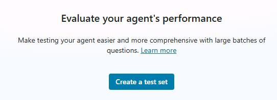

1. Select **Generate 10 questions**. 

	

1. Hover over any of the **generated 10 questions** and you'll see a recycle bin icon. If the AI‑generated question doesn't meet your expectations, use the recycle bin to delete it.

	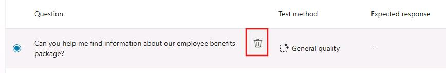

	{: .note }
    > The default **Test method** may not be configured as needed. You can select any critical question and change the **Test method** to **Quality**, **Similarity**, or **Text match**.
	>
	> The default method is Quality, which offers two options: **General quality** or **Compare meaning**.
	> - **General quality** - Checks whether the answer is relevant, complete, and meets basic quality standards.
    > - **Compare meaning** - Checks whether the answer has the same meaning as the expected response, even if worded differently.

	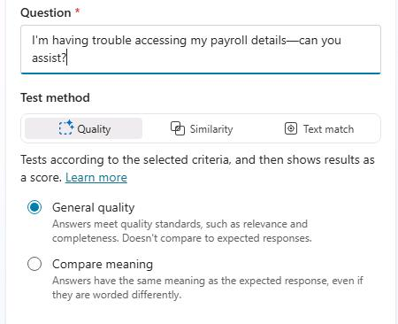

1. Select the **Compare meaning**.

	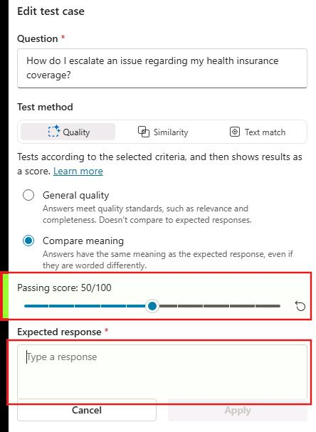

1. Select the **Similarity** tab. In **Expected response**, you can enter a sample answer, this helps guide the evaluation by defining what a correct response should look like, along with the **passing score**. This works similarly to the **Compare meaning** option under the **Quality** tab.

	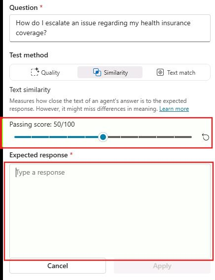

	> **Similarity** checks how closely the bot's wording matches your expected answer, while **Compare meaning** (under Quality) checks whether the bot's answer conveys the same meaning even if phrased differently.
	>
	> Use **Similarity** for strict phrasing, and **Compare meaning** option under **Quality** tab for flexible, natural responses.
	>
	> The **passing score** sets the minimum similarity or meaning‑match level the bot must reach for the test to be considered successful.
	>
	> A higher score demands a closer match to your expected response; a lower score allows more variation.


1. You can also manually add to the 10 generated questions, by selecting **Add questions** and then selecting **Write**.

	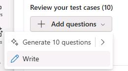

1. On the top right, in the **Question** text area, type: 

    ```
    Is there a way to get a report on recent marketing performance metrics?
    ```

1. Select the **Similarity** tab and set the passing score to **80**.

1. In the **Expected response** field, enter the following text:

	```
    You can get a recent marketing performance report by using built‑in dashboards in tools like GA4, Google Ads, Meta, LinkedIn, HubSpot/Marketo, or your CRM, or by scheduling automated reports or exporting data into a template. If you want, I can generate a consolidated last‑30‑days cross‑channel report with key KPIs and deliver it by email.
    ```

	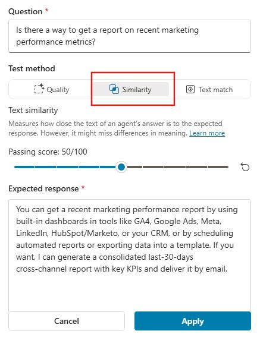

1. Select **Apply**.

	

1. Select **Manage profile**.

	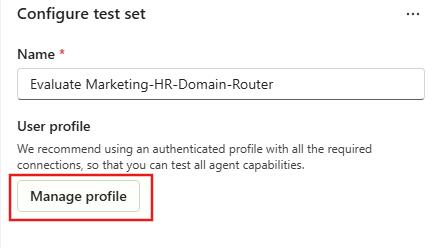

1. Select **User** and then select your user ID.

	


1. In the **Connections** section, add each tool to the test case. 

	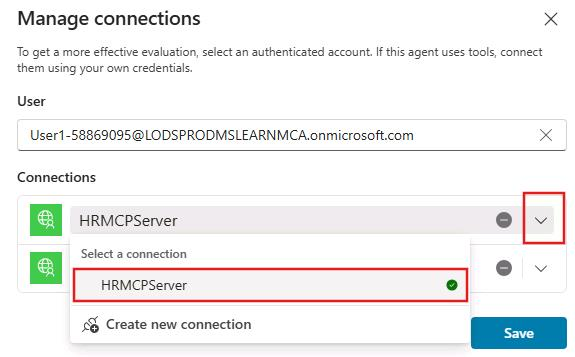

1. Select **Save**.

	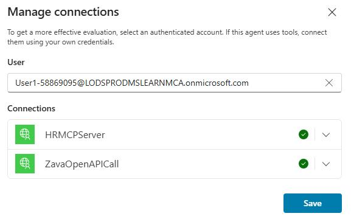


1. Select **Evaluate** and wait for it to finish reviewing the results. 

	{: .warning }
    > It can take 20 minutes or more to complete the evaluation. You may want to skip running the evaluation now since you'll need to run an evaluation in the next task.

	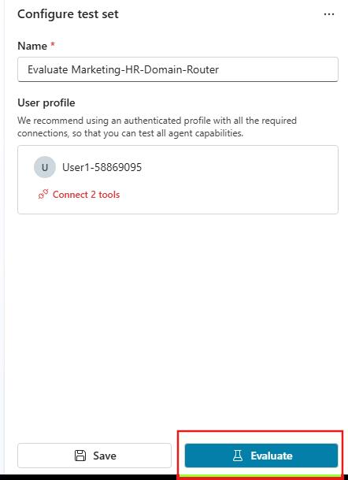

---

#### 02: Review the evaluation test set 

1. Select **Evaluation** and then look at the Score.

	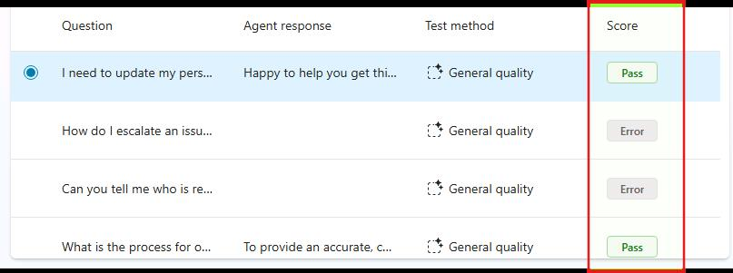

1. Select any **Pass** question and then review the results. If you want to understand the mapping activity, select **Show activity map**. 

	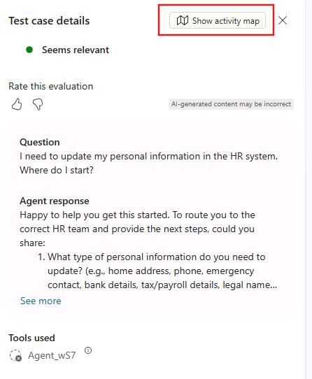
