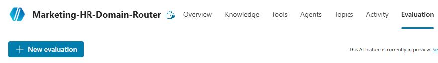
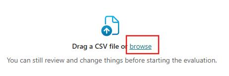
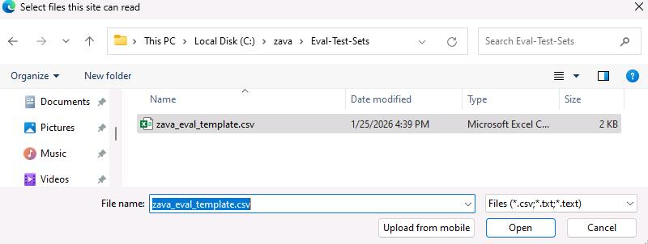
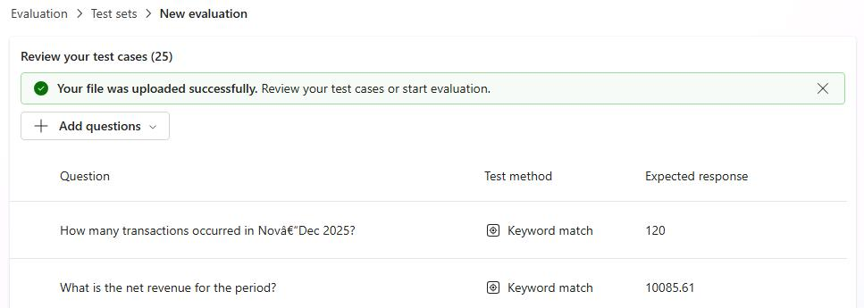
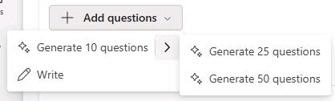
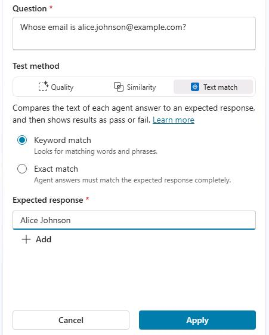
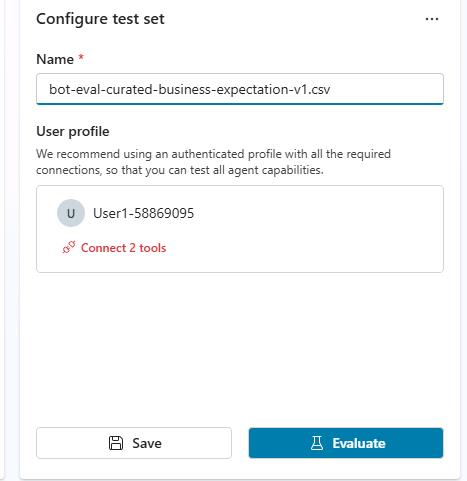

## Task 03: Provision and configure a CSV‑based evaluation framework for test execution

### Introduction

To certify agents at scale, Zava’s COE needs curated, stakeholder-aligned test suites that are repeatable across versions and environments. A CSV-based framework provides a portable baseline that can be executed consistently as agents evolve.

### Description

In this task, you'll import a curated CSV test set, validate its structure, and configure evaluation methods for high-value business questions. This establishes a repeatable evaluation baseline that can be re-run for regression testing and lifecycle approvals.

### Success criteria

- The curated CSV test set is imported, configured with appropriate test methods, and executed as a repeatable evaluation baseline.

### Key steps

---

#### 01: Create an evaluation test set using AI and add a record manually.

1. Open **Marketing-HR-Domain-Router** parent agent and select **Evaluation**.

	

1. Select **New evaluation**.

	

1. Select **browse**.

	

1. Go to `C:\zava\Eval-Test-Sets`, select **zava_eval_template.csv** file, and then select **Open**.

	

	{: .note }
	> Once the import is complete, you should see a screen similar to the one below.

	

1. Review the test sets. You can still use AI to generate additional questions or add new test sets manually.

	

1. Search and select `Whose email is alice.johnson@example.com?`. Select **Text match**, select **Keyword match**, and then select **Apply**.

	

1. Repeat the same process for the following questions:

   - `Which promotion had the highest average discount per order?`
   - `Who is the HR Director?`
   - `Who is the HR Manager?`
   - `Which employee handles Compensation and Benefits?`
   - `Which employee focuses on Diversity and Inclusion?`
   - `Who speaks French?`
   - `Which employee can support Italian-speaking candidates?`

1. In the **Configure test set** dialog, in the **Name** field, enter `bot-eval-curated-business-expectation-v1.csv` and then select **Evaluate**. Wait for the process to complete. 

	

	{: .warning }
    > It may take more than 20 minutes for the process to complete.