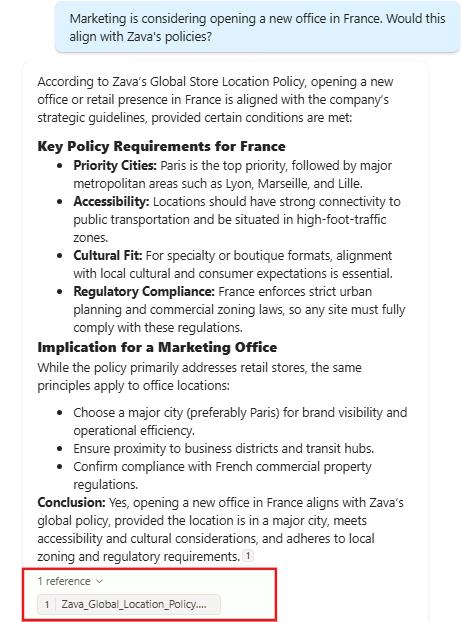
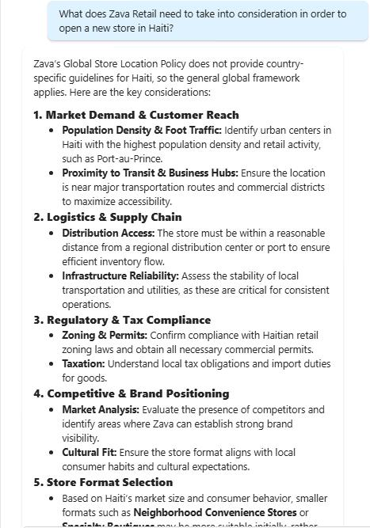
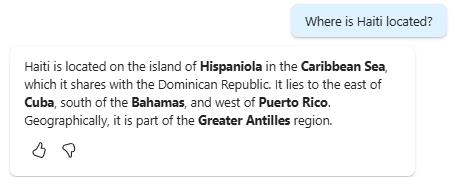
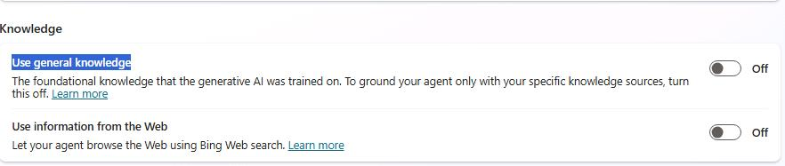
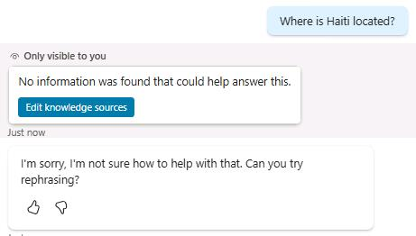
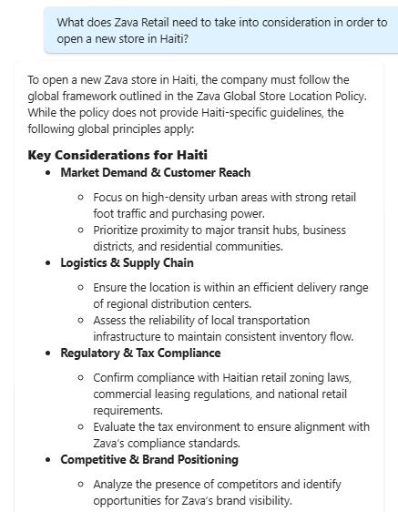

## Task 04: Discover how default internal knowledge is may impact your accuracy

### Introduction

Zava’s risk posture depends on preventing agents from “filling in gaps” with general model knowledge when enterprise policy or internal guidance is incomplete. This is especially critical in sensitive scenarios where confident but ungrounded answers could violate policy or create operational risk.

### Description

In this task, you'll test how an agent behaves when internal knowledge and default general knowledge are both available. You'll observe how responses can become misleading when the model relies on internal assumptions or general world knowledge, then apply configuration changes to constrain behavior and improve predictability.

### Success criteria

- The agent’s behavior is validated and corrected so it no longer relies on general knowledge when it should only answer using approved internal sources.

### Key steps

---

#### 01:

1. Open the `Zava International Location Advisor` agent.

1. On the command bar, select **Test**.

	

1. Submit the following prompt: 

	```
    Marketing is considering opening a new office in France. Would this align with Zava's policies?
    ```

	

1. Review the response. It shows that the agent is pulling information directly from the company's business knowledge, and it provides a citation at the end to confirm exactly where that information came from.

1. Submit the following prompt: 

	```
    What does Zava Retail need to take into consideration in order to open a new store in Haiti?
    ```

	

1. Review the response. The agent produced a full recommendation for opening a store in Haiti, despite this request violating Zava Retail policy. It also relied entirely on internal business knowledge, which incorrectly suggests official guidance exists for this scenario. This makes the behavior problematic and highlights the need for better safeguards.

1. Submit the following unrelated but still relevant prompt:

	```
    Where is Haiti located?
    ```

	

1. Review the response. The outcome is a common pitfall. Many businesses want to harness the power of an LLM but aren't aware of when it will fall back on its internal knowledge-and why that can be risky. In this case, the agent used general world information even though that wasn't the intended behavior.

	To address this, youneed to go to the settings and turn off this option. If that does not resolve the issue, the next step is to review the agent instructions.

1. Go to **Settings** and move down until you reach the **Knowledge** section. 

	

1. Set **Use general knowledge** is turned on. If so, turn it **Off** and then save the changes.

	

1. Submit the following prompt and observe that the agent is now unable to generate a response: `Where is Haiti located?`.

	

1. Let's test a prompt that is closely aligned with Zava's internal business knowledge. It is entirely possible that Zava may want to open an office in Haiti. Notice how the agent was able to leverage internal data and follow Zava's global policy norms when responding to the prompt:

	```
    What does Zava Retail need to take into consideration in order to open a new store in Haiti?
    ```

	