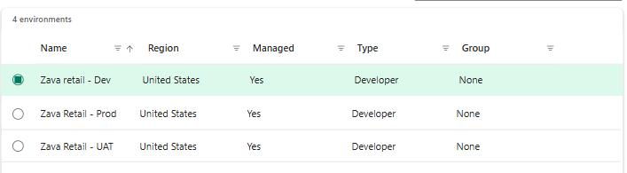
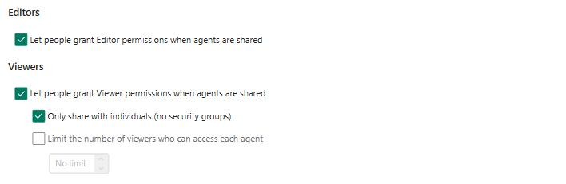

## Task 01: Configure PPAC Sharing Controls

The goal of this task is to ensure your Copilot Studio agents are shared safely and only with the right people. Managing sharing is important because overly broad access can expose sensitive data, grant unintended editing permissions, or allow agents to be shared across the organization without proper oversight. 

When configuring these controls, you should consider who truly needs Editor vs. Viewer access, whether sharing should be limited to individuals rather than security groups, and how broadly agents should be allowed to circulate across the tenant.

## Key steps

### 01: Configuring Editors and Viewers

1. From the Power Platform Admin Center (PPAC) Home page, navigate to **Security**, then **Identity and Access**.

1. Select **Manage sharing** then select the **Environments** tab.

1. Select your environment: **Zara Retail - Dev** environment and then **Manage sharing**.

	

1. From **Editors** section, check: **Let people grant Editor permissions when agents are shared.**

	{: .note } 
	> **Note:**
    > - **If enabled:** makers can assign Editor access (full edit, publish, and share rights).
    > - **If disabled:** no user can share an agent with Editor-level permissions-reducing oversharing risk.

1. From **Viewers** section, check: **Let people grant Viewer permissions when agents are shared** and **Only share with individuals (no security groups)**.
	{: .note }  
	> If you want tighter governance, check **Only share with individuals (no security groups)**. This prevents broad distribution through security groups.
    >    - Optionally, combine this with environment **sharing limits** to restrict the number of Viewers allowed.

	

1. Select **Save** to apply the governance rule, and then **Close**.

1. Select **Guest access** and then choose the **Zava Retail - Dev** environment.

1. Review the information on the blade window, and then select **Close** on the lower side of the window.

#### **Guest Access check:** 

**Guest access** is blocked by default in Copilot Studio environments, but it's important to verify that the setting is still enabled as part of your governance review.

**Why this matters for this task:**
Blocking **guest access** helps prevent oversharing and unauthorized external access to Copilot Studio agents. Even though Task 1 focuses on Editor/Viewer permissions and sharing limits, guest access is an additional governance layer that ensures external users cannot reach agent content.
