## Task 02: Enforce authentication and test guardrails

In this task, you'll disable "No authentication" so the agent requires Microsoft Entra ID authentication.
This is important because PPAC guardrails only apply to agents that require authentication, and you won't be able to properly test Viewer/Editor restrictions, sharing limits, or access controls if the agent is open to anonymous users.

### 01: **Data protection and privacy**

You need **Zava International Location Advisor** agent to perform this task. Skip below steps and go to step **Set Up a PPAC Policy to Enforce Authentication** if the agent is present.

**Import 'Zava International Location Advisor'** agent.

1. From the browser tab bar, select the **Home - Microsoft Copilot Studio** tab.

1. From the left side bar, select **Agents**, then from the upper right side of the screen, **Import agent**.

1. On the top action bar, select **Import solution**.

1. Select **Browse** then, from the Zava folder on the local machine (**C:\zava\Agent-Context-Optimization**), select **zavaretailstore_1_0_0_1.zip** to import it.

1. After selecting the zip file, select **Open**.

1. In the **Import a solution** blade window, select **Next**, then **Import**.

1. Select the refresh browser icon  to view the new agent: `Zava International Location Advisor`.

	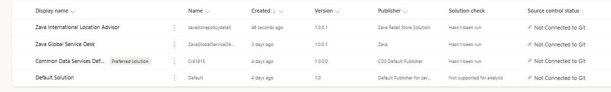

1. From the browser tab, select the **Agents - Microsoft Copilot Studio** tab and select the new agent: **Zava International Location Advisor**.

1. Go to the agent's **Settings** and select the **Security** category in the left side menu.

	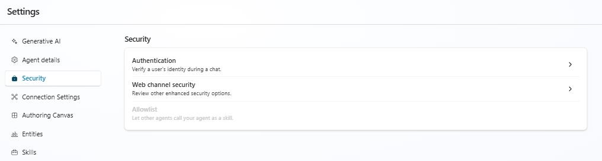

1. Select **Authentication** and review the information.

	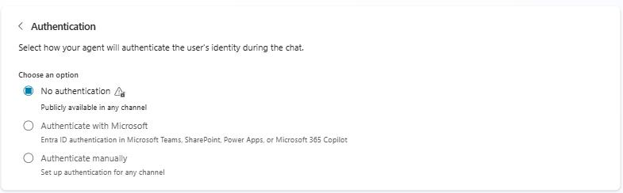

{: .note } 
> **Notice** how the **No authentication** option is enabled. This isn't because the agent must be public, it's simply the default setting in Copilot Studio. However, leaving it on means anyone with the link can access and chat with the agent, which bypasses PPAC guardrails and increases the risk of sensitive‑data exposure; therefore, it needs to be disabled.

---

### 02: Set Up a PPAC Policy to Enforce Authentication
1. Go to the Power Platform Admin Center (PPAC) - from the browser tab bar, select the first tab, **Power Platform admin center**.

1. In the left side menu, navigate to **Data and privacy**.

	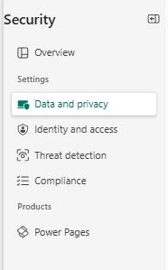

1. Select **Data policy**, then **New policy**.

1. Name your policy: **ppac-disable-no-auth-copilot-agent**, then select **Next**.

1. In the connectors **search bar**, type **Chat without Microsoft Entra ID authentication in Copilot Studio** and press **Enter**.

	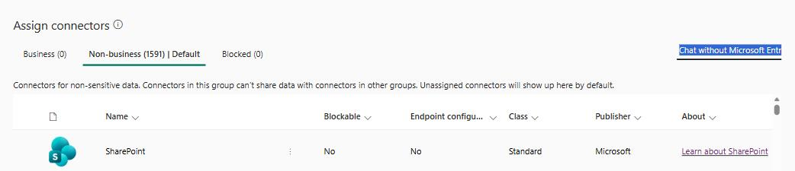

1. Select the **Chat without Microsoft Entra ID authentication in Copilot Studio** connector from the results. 

1. Select **Next** three times and then select **Create policy**.

1. In the browser tab bar, go back to Copilot Studio: select the **Security - Zava International Location** tab.

{: .note }
> **Notice** that because No authentication is disabled, a warning message appears: 'No authentication and service provider Generic OAuth 2 aren't available due to changes in your organization's data loss prevention policy. Contact your admin with questions.' This is expected behavior when DLP rules block anonymous access.

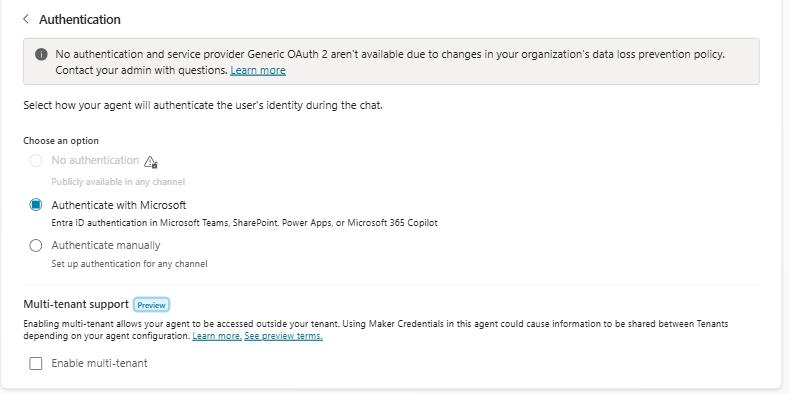

---

### 03: Auditing for verification, not enforcement

By enforcing strong security controls, you ensure guardrails are firmly in place and that's exactly what we accomplished in the "Set Up a PPAC Policy to Enforce Authentication" step. However, enforcing guardrails alone isn't enough; we still need to track activity. That's where auditing comes in. 

Auditing provides the visibility to verify that guardrails are functioning as intended. It captures critical events such as who accessed the agent, who modified authentication settings, or who attempted to share it, making auditing an essential layer for validating governance and maintaining compliance.

1. Go back to the Power Platform Admin Center (PPAC): in the browser tab bar, select the **Data policies - Power Platform admin center** tab.

1. On the left side menu, navigate to **Compliance**.

	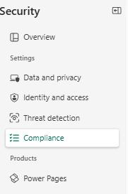

1. Select **Auditing**, then select the **Zava Retail - Dev** environment.

1. Select **Set up auditing** then select **Turn on auditing**.

    {: .important }
    > - **User sign-ins:** **Turn on** this on when you need to track who is accessing the agent, when, and from where. Useful for security investigations and access monitoring.
    >
    > - **Activity:** **Enable** when you want to track what users are doing like updates, changes, or interactions. Helpful for audit trails, change tracking, and usage insights.
    >
    > - **Common entities across Dynamics 365:** **Enable** if your solution uses standard Dataverse/D365 entities and you need auditing for them. Use when auditing core business data is required for compliance or operations.

1. Under **Event log retention**, select the dropdown arrow, and then pick the **Two years** option.

    {: .important }
    > **Event log retention:** Choose based on your compliance rules and storage strategy:
    >
    >   - **30-180 days:** Short-term troubleshooting or low‑risk environments.
    >   - **1-2 years:** Most organizations with standard audit requirements.
    >   - **7 years:** Regulated industries (finance, healthcare, government).
    >   - **Forever:** Only when you MUST retain all history and storage isn't a concern.
    >   - **Custom:** When policies require a specific retention period.

	
    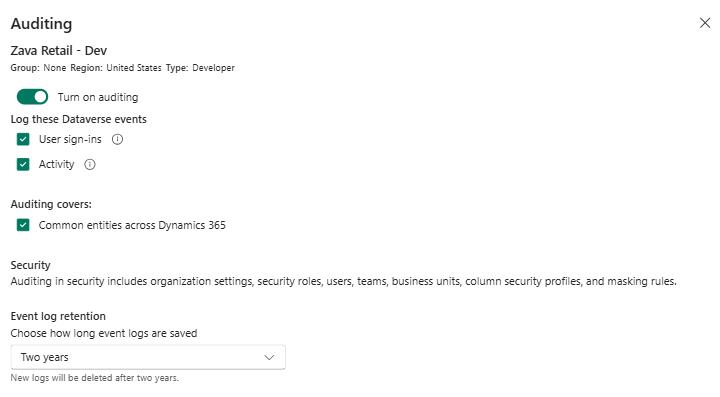

1. Select **Save**.

The **[Bot Transcript Viewer](https://learn.microsoft.com/en-us/microsoft-copilot-studio/admin-transcript-controls)** must be part of your auditing and governance process, and it should be treated as a high‑risk, high‑privilege role.

This role provides access to full conversation transcripts, which may include sensitive information such as PII, PHI, SSNs, credit card numbers and other confidential business data. Microsoft confirms that transcripts include the entire conversation, and sensitive‑data scrubbing is not currently supported.

---

### 04: Access all bot roles

1. From the left side menu, select **Manage**, then select the **Zava Retail - Dev** environment.

	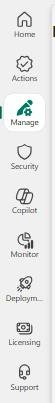

1. From the top action menu, select **Settings**, then **Users + permission**.

1. From the list of options under **Users + permission**, select **Security roles**.

	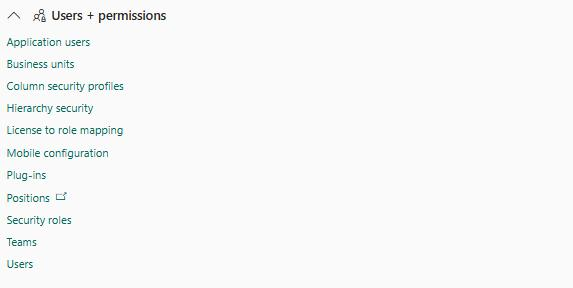

1. Scroll down and select the elipses **( ...)** next to **Bot Transcript Viewer**.

	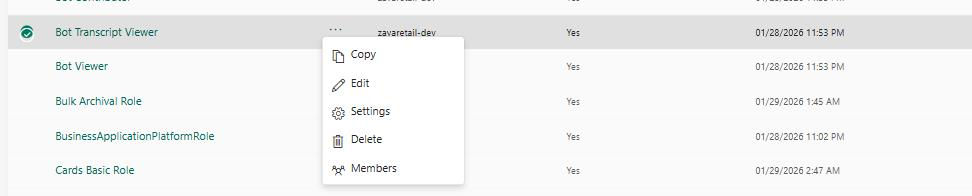

1. Select **Members** to display what users or security group have access.

1. Select **+ Add people**.

1. In the **Add people** blade window, type **irvin** in the search bar and press Enter, then select the result **Irvin Sayers** and then **Add**.

	

{: .important }
> If there are no **data‑residency constraints** for your organization, you're welcome to enable **Tenant‑level analytics** under **Power Platform Admin Center → Monitor** to get richer insights across your environments.
