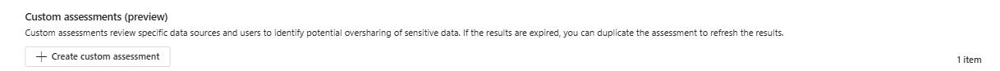
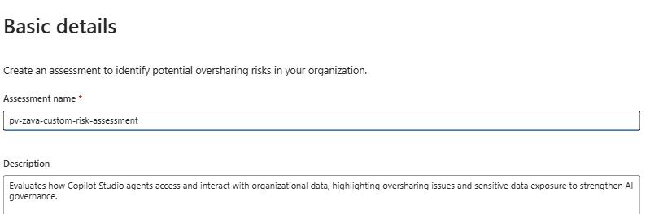
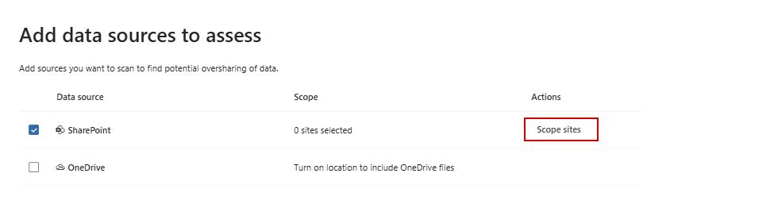
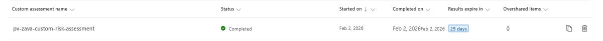

## Task 03: Run Purview DSPM Risk scan

1. Switch to the Microsoft Purview portal by selecting the **Microsoft Purview** tab in the browser.

1. From **DSPM for AI**, go to **Data risk Assessment**, then under **Custom assessments (preview)**, select **+ Create custom assessment**.

	

1. Type the **Assessment name**: **pv-zava-custom-risk-assessment**.

1. In the **Description** field, type: **Evaluates how Copilot Studio agents access and interact with organizational data, highlighting oversharing issues and sensitive data exposure to strengthen AI governance.**

	

1. Select **Next**.

1. Under **Add users**, leave the **All** option selected and select **Next**. 

    {: .important }
    > The ideal setup is to choose "All users" for full, organization‑wide visibility, except when you're running a pilot, investigating specific high‑risk departments, or conducting a targeted investigation, in which case selecting **specific users or groups** is the better and more focused option.

1. In the **Add data sources to assess** section, under the **Actions** column, select **Scope sites**, then **Include specific sites**

	

    {: .important }
    > The ideal setup is to include SharePoint as the primary data source since oversharing most commonly occurs across shared sites and libraries, but you should add OneDrive as well when you need visibility into personal storage where individuals may store or share sensitive files; otherwise, leave OneDrive off if your assessment is scoped only to organizational sites or you want to avoid scanning personal user data.
    
    {: .note }
    > For the sake of this demo you'll keep the scope sites under **Zava Retail Store** SharePoint.

1. Select the dropdown next to **+ Include**, then choose **From all sites**.

1. Under **Site ID**, check **Zava-labs-env** then select **Done** twice then **Next**

1. Select **Save and run** then select **Done**.

1. You'll  be redirected to **Data risk assessments** portal. Select the **pv-zava-custom-risk-assessment** assessment.

	

{: .note }
> It could take several minutes before the **Run** is done.