## Task 04: Apply Purview protections and retest

### 01: Classify and label the data with sensitivity labels

1. From the left side menu, select **Solutions**, then select **Information Protection**.

	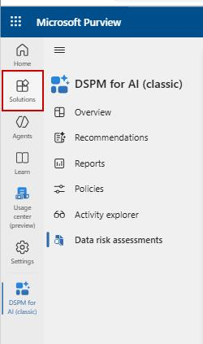

1. Select **Sensitivity labels**, then **+ Create**, then select **Label** in the dropdown menu.

1. In the **New sensitivity label** wizard, provide the following info:
   
   - **Name:** **pv-zava-Confidential-HR**
   - **Display name:** **Confidential - HR**
   - **Label priority:** - `(leave the default value)`
   - **Description for users:** **Use this label to protect highly sensitive HR documents and ensure they aren't shared or accessed by unauthorized individuals.**
   - **Description for admins:** **Applies strict protections, including access controls, encryption, and sharing restrictions to safeguard HR-related confidential data across Microsoft 365.**
   - **Label color:** Choose the **burgundy red** button (recommended), since it universally signals high sensitivity / restricted content.

	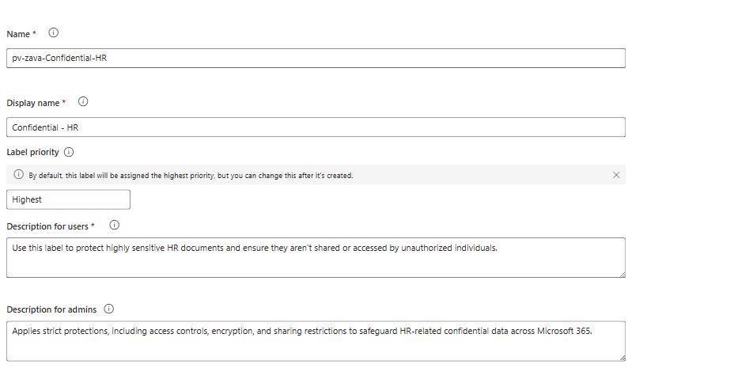

1. Select **Next**.

1. Leave the default values for **Define the scope for this label** and select **Next**.

    {: .note }
    > The ideal scope for **pv‑zava‑Confidential‑HR** is to enable files and other data assets since HR documents contain highly sensitive information such as PII, payroll, and performance data; enable Emails because HR frequently exchanges confidential attachments; optionally enable Meetings when HR discusses sensitive topics that require protecting agendas and preventing forwarding; enable Groups and sites only when you need to label and secure entire HR SharePoint sites or Teams; and include Azure/Fabric data assets only if HR stores or processes structured data within those environments.

1. Enable **Control access** and **Apply content marking** by checking their respective checkboxes, then select **Next**.

    {: .note }
    > For a **Confidential‑HR** label, you should **enable Control access** to strictly limit who can open and view protected HR items, and enable **Apply content marking** if you want visible indicators like headers, footers, or watermarks to remind users the data is highly sensitive; Protect Teams meetings and chats is optional and only needed if HR regularly conducts sensitive meetings in Teams-and note that it requires a Teams Premium license to activate.

    {: .important }
    > **Configure Configure access control settings:** This enables encryption and permissions enforcement.
    > - To ensures **HR files** are automatically protected whenever labeled. Set **Assign permissions now or let users decide?** to **Assign permissions now**
    > - For internal HR labels, set **User access to content expires** to **Never** to ensure authorized HR staff retain continuous access to protected content without interruption, unless your organization's policy requires otherwise.
    > - Set **Allow offline access** to **Always** so HR users can open encrypted files even when they're not connected to the network, unless your organization's security policies require stricter restrictions.

1. Select **Assign permissions** under **Assign permissions to specific users and groups**.

1. Select **Add all users and groups in your organization** then **Save**.

    {: .note }
    > when you select **Assign permissions**, Purview opens a panel where you can precisely control who is allowed to open, view, edit, or share content protected by this HR label. You can narrow access by selecting one or more of the following options:
    >
    > - **Add all users and groups in your organization** - broad access (not recommended for HR).
    > - **Add any authenticated users** - grants access to anyone signed in (never use for HR).
    > - **Add users or groups** - the best option for HR labels, where you can restrict access to specific security groups such as "HR Department," "HR Managers," or "HR Leadership."
    > - **Add specific email addresses or domains** - used only for tightly controlled external collaboration, if allowed by policy.
    >
    > Once users or groups are added, you can select **Choose permissions** to assign specific rights (like View, Edit, Save, Print, Copy, Reply, etc.), ensuring the HR label encrypts the content and limits access only to the intended individuals.

    {: .note }
    > **Optional settings**:
    >   - **Dynamic watermarking** → ON if your org wants visible "Confidential - HR" watermarks.
    >   - **Double Key Encryption** → Only if your org requires the highest protection level (very rare, usually regulatory).

1. Select **Next**, then enable **Content marking**.

1. Check **Add a header**, then on **Customize text**, set **Header text** to **Confidential - HR Data** then **Save**.

	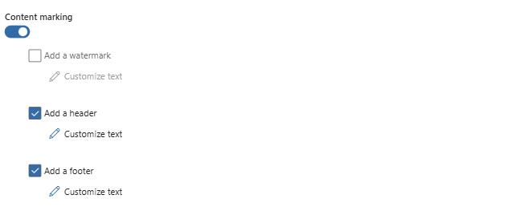

    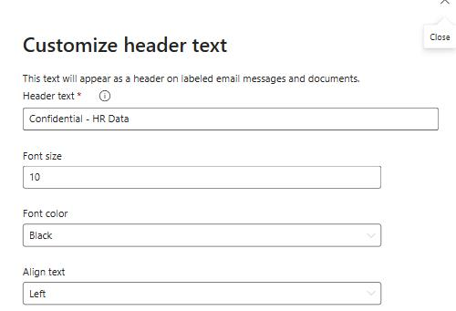

1. Under **Add a footer**, select **Customize text**, and set **Footer text** to **Authorized HR personnel only - Do not share**, then select **Save**.
	
    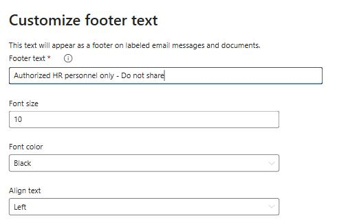

1. Under **Auto-labeling for files and emails**, turn on **Auto-labeling for files and emails**.

1. Under **Display this message to users when the label is applied** type **Confidential - HR (Auto‑labeled when conditions are met)**.

	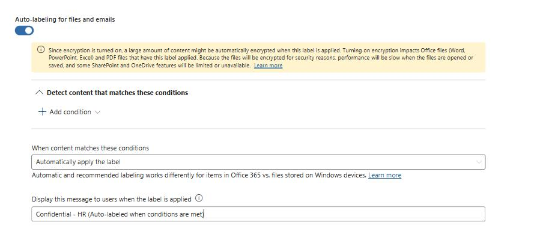

1. Select **Next**.

1. On **Define protection settings for groups and sites**, leave the default values and select **Next**.

    {: .note }
    > **Define protection settings for groups and sites:** These settings let you control how Teams, SharePoint sites, and Microsoft 365 Groups behave when this HR label is applied. You can restrict privacy and external user access to ensure only authorized internal members can join; control external sharing and Conditional Access to prevent HR sites from being shared outside the organization; and manage private teams discoverability and shared channel settings so confidential HR teams remain hidden from search and cannot be invited into shared channels.

1. Select **Create label**.

1. In the **Sensitivity labels** list, select the new label: **Confidential - HR**.

	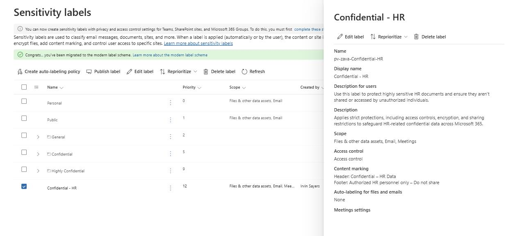

    {: .highlight }
    > In a real environment, you'd need to wait a few minutes for the label to be created.

    {: .warning }
    > In the real environment, if you see a message like: `Your organization has not turned on the ability to process content in Office online files that have encrypted sensitivity labels applied and are stored in OneDrive and SharePoint.` You can turn on here, but note that additional configuration is required for Multi-Geo environments.
    > Select **Turn on now** if you see above warning message

---

### 02: Create DLP policies for Copilot and the agent

1. From the left side menu, select **Solution**, then **Data Loss Prevention**.

1. Select **Policies**, then **+ Create policy**.

1. Select **Enterprise applications & devices**.

1. Select **Custom** then **Custom policy**, and then **Next**.

	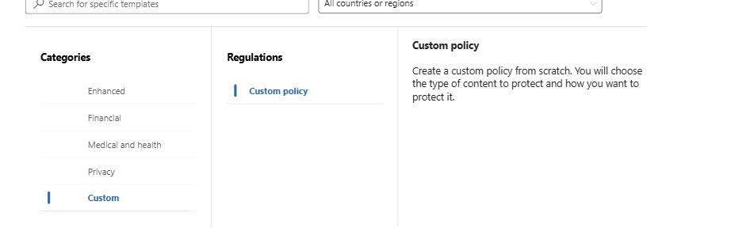

1. In the **Name yor DLP policy** section, fill in these fields:

   - **Name:** **pv-zava-Data-Loss-Prevention**
   - **Description:** **Prevents sensitive data from being accessed or used improperly by monitoring, detecting, and blocking risky data actions across Microsoft 365 and Copilot.**

	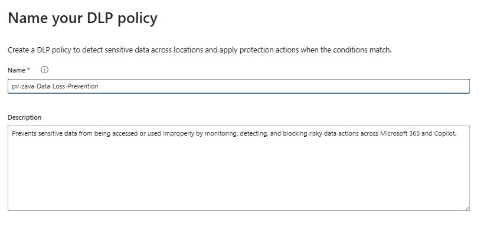

1. Select **Next** twice.

1. In the **Choose where to apply the policy** section, choose **Microsoft 365 Copilot and Copilot Chat** and then **Next**.

	

1. Make sure **Create or customize advanced DLP rules** is selected then select **Next**.

1. Select **+ Create rule** and provide the following details:

   - **Name:** **Block Copilot from processing Confidential‑HR content****
   - **Description:** **Prevents Copilot and Copilot Chat from using or summarizing files labeled Confidential‑HR and all unrestricted users.**

1. Select the **+ Add condition** dropdwon, then select **Content contains**.

	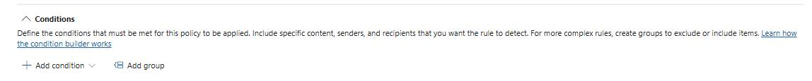

1. In the **Group name** field, type: **Zava-HR-Rule**, then select **Add**.

	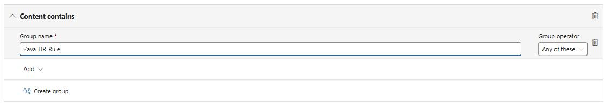

1. Select **Sensitivity lables**, then check the following options:

   - **All Employees** - Confidential/All Employees
   - **All Employees** - Highly Confidential/All Employees
   - **Confidential-HR** - Confidential-HR

	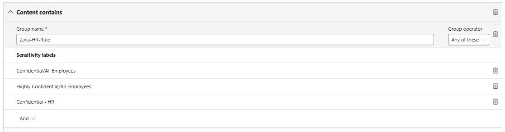

1. Select **Add**.

1. Under **Actions**, select **+ Add an action**, then select **Restrict Copilot from processing content**.

	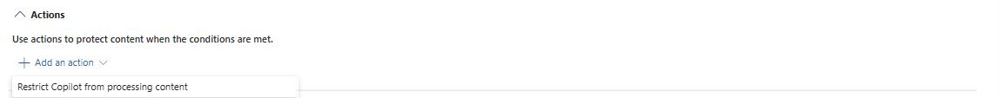

1. Check the box for **Accessing knowledge sources**.
	
    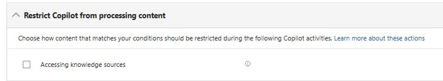

1. Leave the rest of the settings as default, select **Save**, then **Next**.

1. In the **Policy mode** section, select **Turn the policy on immediately**, then select **Next** and **Done**.

	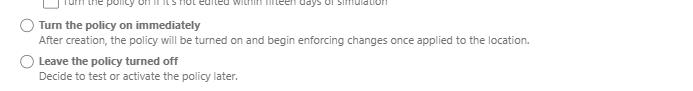

{: .note }
> In a real environment, this process may take up to 2 hours.