## Task 05: Review telemetry and document approval

#### 01: Assess the agent's functionality
In this step, you'll assess the agent's functionality and verify compliance with the established governance policies, using telemetry insights from Purview and PPAC.

1. Switch to Copilot Studio: in thew browser, select the **Security - Zava International Location** tab.

1. You're in the security settings of the **Zava International Location Advisor** agent. In the left **Settings** menu, select **Generative AI**. 

	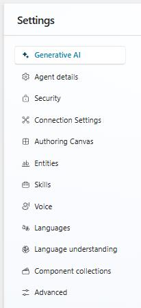

1. Under **Knowledge** make sure **Use general knowledge** is disabled. Do not forget to **Save** your change before exit.

	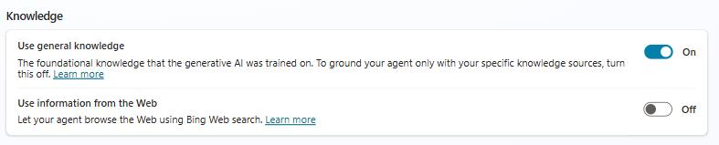

1. Close the **Settings** window, by selecting the **X** in the upper right side of the page.

1. In the right test panel, type this prompt: **Who is the cashier associated with ID NYC-FLG-001-EMP-001?** and then select the **Send** icon.

	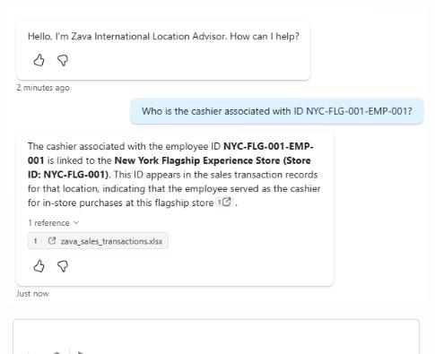

    {: .important }
    > Notice that even though we put in place many rules and policies, Copilot Studio still wasn't able to classify the citation. The reason is that Copilot Studio relies entirely on existing Microsoft Purview sensitivity labels.
    >
    > If a document has no label applied, Copilot Studio simply treats it as General or Unlabeled, because it does not classify or label the file on its own. Copilot Studio has no way to determine that your file should be "Highly Confidential" unless you have already labeled it in Purview-for example, in Office apps, SharePoint, or via auto‑labeling policies.

1. To change the label of the knowledge source, you'll need to switch to the SharePoint. From the browser tab bar, select the **Zava-Retail-Data - Documents** tab.

1. Select the **cashiers.xlsx** file to open it in the browser.

	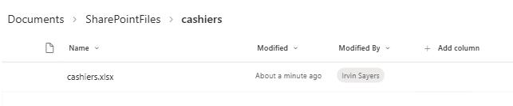

1. In the excel file, at the very top left, notice a policy **icon** next to the file name. Select it, and pick **Confidential - HR**.

	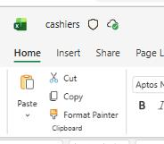

    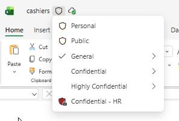

1. Go back to the **Topics - Zava International Location Advisor** tab and select **New test session** to clear the chat.

	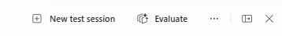

1. Type the same prompt again, **Who is the cashier associated with ID NYC-FLG-001-EMP-001?** and select **Send**.

1. Notice how the citation you modified earlier is now marked as **Confidential - HR**.

    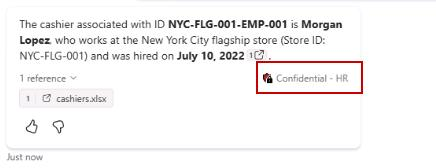

---

#### 02: View Types of sensitivity labels downgraded - Steps

Remember you've changed the **Cashiers** label in excel to **Confidential - HR**. Next, you'll track it.

To begin, start by logging into Microsoft 365 Purview portal with your admin credentials: 

1. In the browser tab bar, select the **Policies | Microsoft Purview** tab.

1. From the left side menu, select **Solution** then **Information Protection**.

1. Select **Reports** then **Sensitivity label changes**.

	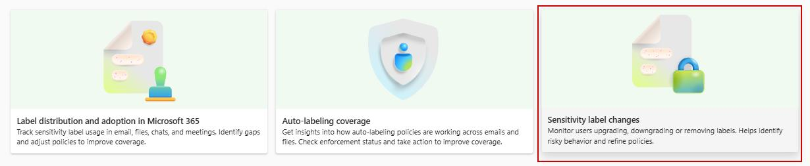

1. Under **Types of sensitivity labels downgraded**, select **View details**.

	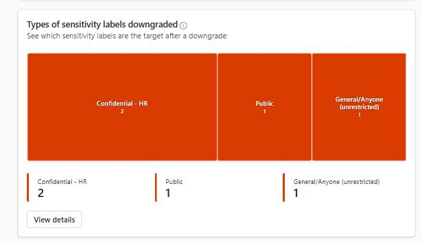

1. Notice how one file downgraded from your HR policy we created to Public. Surch insights are important.

{: .important }
> Reviewing Types of sensitivity labels downgraded is critical for business risk management because downgraded labels can directly weaken your organization's data protection posture. When a file like the Cashiers Excel workbook is changed from Confidential - HR to Public, it becomes significantly more exposed. This increases the risk of unauthorized access, accidental sharing, and misuse of HR data. 
>
> Monitoring downgrade events helps the business quickly identify misclassification, prevent sensitive information from being handled incorrectly, and maintain compliance with internal policies and regulatory requirements. In short, this step ensures the company protects high‑risk data and avoids costly security gaps caused by improper label changes.

---

#### 03: Review AI Interaction Telemetry in Activity Explorer - Steps

1. From the left side menu, select **Solutions** then **DSPM for AI (classic)**.

1. Select **Reports**, then scroll down until **Data** and under **Sensitive interactions per AI app**, select  **View details**.

	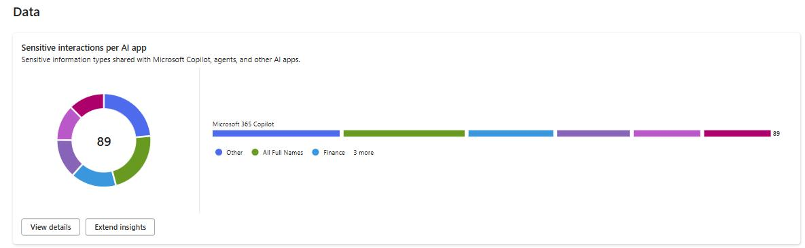

1. Select **Sensitivity label: Any** and filter by **Confidential-HR**.

	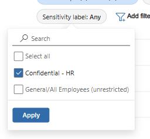

1. Select **Apply** to confirm the filter choice.

1. Select the second item, **Ai Interaction**, you may not have permission to see the prompt but you can clearly see **cashiers.xlsx** files we modified and C**Copilot Studio** returned it as a citation when we prompted **Who is the cashier associated with ID NYC-FLG-001-EMP-001?**

	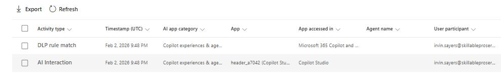

    {: .note }
    > This step is important because Activity Explorer provides verifiable, item‑level evidence of how Copilot interacts with sensitive data. By reviewing which files-such as the Cashiers HR‑labeled workbook-were accessed by the agent, the business can confirm that AI activity aligns with governance policies, detect any inappropriate access early, and demonstrate compliance to auditors. This visibility protects the organization from data‑handling risks, ensures HR information remains properly controlled, and supports regulatory and internal security requirements.

---

### Congratulations
You've completed this exercise!